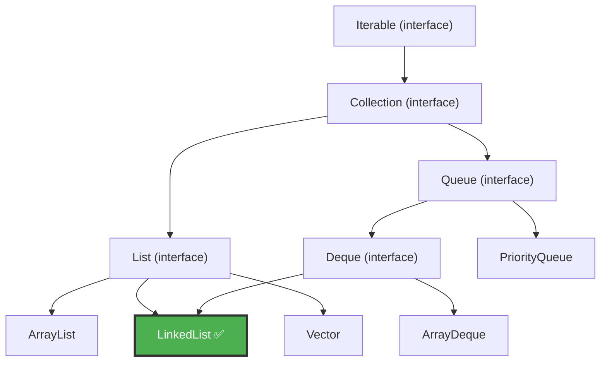
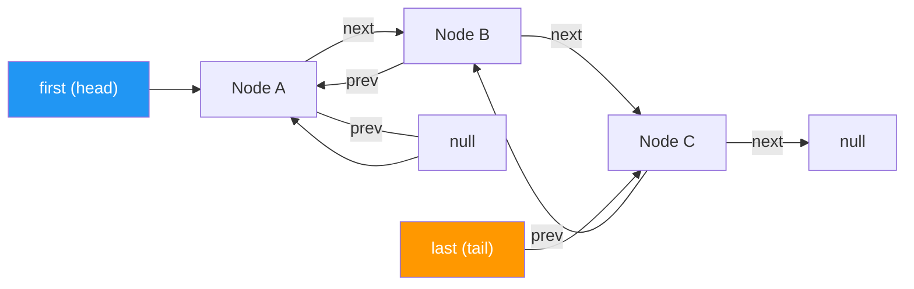
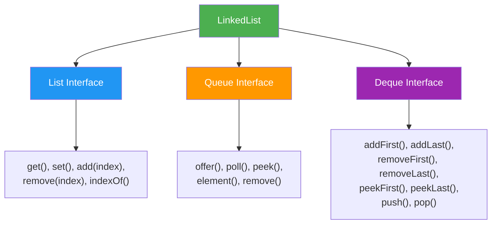

# LinkedList in Java — Complete Interview Notes

---

## 1. Introduction

### What is LinkedList?

A **LinkedList** is a collection (data structure) where elements are stored as **individual nodes**, and each node holds:
- The **data** (your actual element)
- A **pointer to the next node**
- A **pointer to the previous node**

Think of it like a **chain of train coaches** — each coach (node) is connected to the one before it and the one after it. You can add or remove coaches from anywhere without disturbing the rest of the train.

### Why Was LinkedList Introduced?

| Problem with ArrayList | How LinkedList Solves It |
|---|---|
| Inserting/removing in the middle is slow (elements must shift) | Just update two pointers — no shifting needed |
| Needs a continuous block of memory (array) | Each node lives independently in memory |
| Resizing the internal array is expensive | No resizing — nodes are created on-the-fly |

### Which Interfaces Does It Implement?

`LinkedList` implements **four** interfaces:

| Interface | What It Provides |
|---|---|
| `List` | Index-based access, ordered collection |
| `Queue` | First-In-First-Out (FIFO) operations |
| `Deque` | Double-ended queue — add/remove from both ends |
| `Serializable` | Can be converted to a byte stream for storage/transfer |
| `Cloneable` | Can be shallow-copied |

### Collection Framework Hierarchy



> [!IMPORTANT]
> **Interview Point:** LinkedList is the **only** class that implements both `List` and `Deque`. This means it can work as a List, Queue, Deque, and even a Stack — all in one class.

### Internal Working — How LinkedList Works Under the Hood

Java's `LinkedList` uses a **Doubly Linked List** internally.

**Step-by-step — What happens when you add elements:**

```
list.add("A");   // Step 1: Create first node
list.add("B");   // Step 2: Create second node, link to first
list.add("C");   // Step 3: Create third node, link to second
```

**Step 1:** Add "A"
```
  head/tail
     ↓
 [null ← A → null]
```

**Step 2:** Add "B"
```
   head            tail
    ↓                ↓
 [null ← A → ↔ ← B → null]
```

**Step 3:** Add "C"
```
   head                         tail
    ↓                             ↓
 [null ← A ↔ B ↔ C → null]
```

Each node has two arrows — one pointing forward (`next`) and one pointing backward (`prev`).

---

## 2. Internal Structure

### The Node — Building Block of LinkedList

Every element in a LinkedList is wrapped inside a **Node** object. Here's the simplified internal code:

```java
private static class Node<E> {
    E item;        // The actual data
    Node<E> next;  // Pointer to next node
    Node<E> prev;  // Pointer to previous node

    Node(Node<E> prev, E element, Node<E> next) {
        this.item = element;
        this.next = next;
        this.prev = prev;
    }
}
```

> [!TIP]
> **Analogy:** Think of each Node as a **person in a conga line** — each person holds the shoulder of the person in front (`next`) and the person behind holds theirs (`prev`).

### Doubly Linked List Architecture

```
         head                                             tail
          ↓                                                ↓
      ┌────────┐      ┌────────┐      ┌────────┐      ┌────────┐
      │  prev  │◄─────│  prev  │◄─────│  prev  │◄─────│  prev  │
null◄─│ item:A │      │ item:B │      │ item:C │      │ item:D │──►null
      │  next  │─────►│  next  │─────►│  next  │─────►│  next  │
      └────────┘      └────────┘      └────────┘      └────────┘
```

### Key Fields Inside LinkedList Class

```java
transient int size = 0;        // Number of elements
transient Node<E> first;       // Pointer to first node (head)
transient Node<E> last;        // Pointer to last node (tail)
```

### Head and Tail References

| Reference | Points To | Purpose |
|---|---|---|
| `first` (head) | First node in the list | Enables fast insert/remove at the beginning |
| `last` (tail) | Last node in the list | Enables fast insert/remove at the end |



### How Insertion Works Internally (Visual)

**Inserting "X" between "B" and "C":**

**Before:**
```
  A ↔ B ↔ C
```

**Steps:**
1. Create new node X
2. Set X.prev = B
3. Set X.next = C
4. Set B.next = X
5. Set C.prev = X

**After:**
```
  A ↔ B ↔ X ↔ C
```

> [!NOTE]
> No elements are shifted. Only 4 pointer updates are needed. This is why insertion is fast compared to ArrayList.

### How Deletion Works Internally (Visual)

**Deleting "B" from A ↔ B ↔ C:**

**Steps:**
1. Set A.next = C
2. Set C.prev = A
3. Remove B's references (garbage collected)

**After:**
```
  A ↔ C
```

---

## 3. Characteristics of LinkedList

### 1. Ordered Collection

**Explanation:** Elements maintain their **insertion order**. The first element you add stays first, the second stays second, and so on.

**Real-World Analogy:** A **playlist** — songs play in the order you added them.

```java
LinkedList<String> songs = new LinkedList<>();
songs.add("Song A");
songs.add("Song B");
songs.add("Song C");
System.out.println(songs); // [Song A, Song B, Song C]
```

> **Interview Point:** LinkedList preserves insertion order, same as ArrayList.

---

### 2. Duplicate Elements Allowed

**Explanation:** You can store the same value multiple times.

**Real-World Analogy:** A **shopping list** — you can write "Milk" twice if you need two cartons.

```java
LinkedList<String> list = new LinkedList<>();
list.add("Java");
list.add("Java");  // Duplicate — allowed!
System.out.println(list); // [Java, Java]
```

> **Interview Point:** LinkedList does NOT check for duplicates. If you need unique elements, use a `Set`.

---

### 3. Null Values Allowed

**Explanation:** You can add `null` as an element — even multiple times.

**Real-World Analogy:** Empty seats in a train — the seat (node) exists but nobody is sitting there.

```java
LinkedList<String> list = new LinkedList<>();
list.add(null);
list.add("Hello");
list.add(null);
System.out.println(list); // [null, Hello, null]
```

> **Interview Point:** Unlike some collections (like `TreeSet`), LinkedList happily accepts `null` values.

---

### 4. Dynamic Size

**Explanation:** No need to declare a size upfront. It grows and shrinks automatically as you add or remove nodes.

**Real-World Analogy:** A **chain** — you can add or remove links anytime without rebuilding the whole chain.

> **Interview Point:** ArrayList also grows dynamically, but it does so by creating a bigger array and copying elements. LinkedList simply creates a new node — no copying involved.

---

### 5. Non-Synchronized (Not Thread-Safe)

**Explanation:** Multiple threads can modify a LinkedList at the same time, which can cause data corruption.

**Real-World Analogy:** A shared whiteboard with no rules — two people writing at the same time can mess things up.

**How to make it thread-safe:**
```java
List<String> syncList = Collections.synchronizedList(new LinkedList<>());
```

> **Interview Point:** For multi-threaded environments, use `Collections.synchronizedList()` or `ConcurrentLinkedDeque`.

---

### 6. Higher Memory Consumption

**Explanation:** Each element needs extra memory for two pointers (`prev` and `next`) in addition to the actual data.

| Storage | ArrayList | LinkedList |
|---|---|---|
| Data | ✅ Yes | ✅ Yes |
| Previous Pointer | ❌ No | ✅ Yes |
| Next Pointer | ❌ No | ✅ Yes |

**Real-World Analogy:** In ArrayList, people stand in a line. In LinkedList, each person holds a sign pointing to the person in front and behind — more materials needed.

> **Interview Point:** LinkedList uses roughly **3x more memory per element** than ArrayList because of the two extra pointer references and node object overhead.

---

### 7. Traversal Behavior

**Explanation:** LinkedList supports **bidirectional traversal** — you can go forward and backward.

- Forward: using `iterator()` or `listIterator()`
- Backward: using `descendingIterator()` or `listIterator()` with `previous()`

> **Interview Point:** ArrayList allows random access (jump to any index instantly). LinkedList must walk node-by-node from the head or tail — this makes index-based access slow.

---

## 4. Constructors

### Constructor 1: `LinkedList()`

Creates an empty LinkedList.

```java
// Syntax
LinkedList<String> list = new LinkedList<>();

// Example
LinkedList<Integer> numbers = new LinkedList<>();
numbers.add(10);
numbers.add(20);
System.out.println(numbers); // [10, 20]
```

---

### Constructor 2: `LinkedList(Collection<? extends E> c)`

Creates a LinkedList containing all elements from another collection, in the same order.

```java
// Syntax
LinkedList<String> list = new LinkedList<>(existingCollection);

// Example
ArrayList<String> arrayList = new ArrayList<>();
arrayList.add("Apple");
arrayList.add("Banana");

LinkedList<String> linkedList = new LinkedList<>(arrayList);
System.out.println(linkedList); // [Apple, Banana]
```

> [!TIP]
> This constructor is useful when you want to **convert** an ArrayList (or any collection) into a LinkedList.

---

## 5. Complete Method Reference

---

### 🟢 Element Insertion Methods

#### `add(E e)`

| Property | Detail |
|---|---|
| **Syntax** | `boolean add(E e)` |
| **Description** | Adds the element at the **end** of the list |
| **Return Type** | `boolean` — always returns `true` |
| **Time Complexity** | **O(1)** — just update the tail pointer |

```java
LinkedList<String> list = new LinkedList<>();
list.add("A");
list.add("B");
System.out.println(list); // [A, B]
```

> **Interview Note:** `add()` appends to the end, same as `addLast()` and `offerLast()`.

---

#### `add(int index, E element)`

| Property | Detail |
|---|---|
| **Syntax** | `void add(int index, E element)` |
| **Description** | Inserts element at the specified index; shifts existing elements |
| **Return Type** | `void` |
| **Time Complexity** | **O(n)** — must traverse to find the position |

```java
LinkedList<String> list = new LinkedList<>();
list.add("A");
list.add("C");
list.add(1, "B");  // Insert "B" at index 1
System.out.println(list); // [A, B, C]
```

> **Interview Note:** Even though insertion itself is O(1), finding the index takes O(n), so overall it's O(n).

---

#### `addAll(Collection c)`

| Property | Detail |
|---|---|
| **Syntax** | `boolean addAll(Collection<? extends E> c)` |
| **Description** | Adds all elements from another collection to the **end** |
| **Return Type** | `boolean` — `true` if the list changed |
| **Time Complexity** | **O(m)** where m = size of the incoming collection |

```java
LinkedList<String> list = new LinkedList<>();
list.add("A");

List<String> more = Arrays.asList("B", "C", "D");
list.addAll(more);
System.out.println(list); // [A, B, C, D]
```

---

#### `addAll(int index, Collection c)`

| Property | Detail |
|---|---|
| **Syntax** | `boolean addAll(int index, Collection<? extends E> c)` |
| **Description** | Inserts all elements from another collection starting at the given index |
| **Return Type** | `boolean` — `true` if the list changed |
| **Time Complexity** | **O(n + m)** — traverse to index + insert m elements |

```java
LinkedList<String> list = new LinkedList<>();
list.add("A");
list.add("D");

List<String> middle = Arrays.asList("B", "C");
list.addAll(1, middle);
System.out.println(list); // [A, B, C, D]
```

---

#### `addFirst(E e)`

| Property | Detail |
|---|---|
| **Syntax** | `void addFirst(E e)` |
| **Description** | Inserts element at the **beginning** of the list |
| **Return Type** | `void` |
| **Time Complexity** | **O(1)** — just update the head pointer |

```java
LinkedList<String> list = new LinkedList<>();
list.add("B");
list.addFirst("A");
System.out.println(list); // [A, B]
```

> **Interview Note:** `addFirst()` throws no exception. Equivalent to `offerFirst()` and `push()`.

---

#### `addLast(E e)`

| Property | Detail |
|---|---|
| **Syntax** | `void addLast(E e)` |
| **Description** | Inserts element at the **end** of the list |
| **Return Type** | `void` |
| **Time Complexity** | **O(1)** — just update the tail pointer |

```java
LinkedList<String> list = new LinkedList<>();
list.add("A");
list.addLast("B");
System.out.println(list); // [A, B]
```

> **Interview Note:** `addLast()` is functionally identical to `add()`.

---

#### `offer(E e)`

| Property | Detail |
|---|---|
| **Syntax** | `boolean offer(E e)` |
| **Description** | Adds element at the **end** (Queue-style) |
| **Return Type** | `boolean` — returns `true` |
| **Time Complexity** | **O(1)** |

```java
LinkedList<String> queue = new LinkedList<>();
queue.offer("First");
queue.offer("Second");
System.out.println(queue); // [First, Second]
```

> **Interview Note:** `offer()` comes from the `Queue` interface. For LinkedList it behaves the same as `add()`, but in capacity-restricted queues, `offer()` returns `false` instead of throwing an exception.

---

#### `offerFirst(E e)`

| Property | Detail |
|---|---|
| **Syntax** | `boolean offerFirst(E e)` |
| **Description** | Inserts element at the **beginning** (Deque-style) |
| **Return Type** | `boolean` — returns `true` |
| **Time Complexity** | **O(1)** |

```java
LinkedList<String> deque = new LinkedList<>();
deque.offerFirst("B");
deque.offerFirst("A");
System.out.println(deque); // [A, B]
```

---

#### `offerLast(E e)`

| Property | Detail |
|---|---|
| **Syntax** | `boolean offerLast(E e)` |
| **Description** | Inserts element at the **end** (Deque-style) |
| **Return Type** | `boolean` — returns `true` |
| **Time Complexity** | **O(1)** |

```java
LinkedList<String> deque = new LinkedList<>();
deque.offerLast("A");
deque.offerLast("B");
System.out.println(deque); // [A, B]
```

---

#### `push(E e)`

| Property | Detail |
|---|---|
| **Syntax** | `void push(E e)` |
| **Description** | Pushes element onto the **front** of the list (Stack-style) |
| **Return Type** | `void` |
| **Time Complexity** | **O(1)** |

```java
LinkedList<String> stack = new LinkedList<>();
stack.push("Bottom");
stack.push("Top");
System.out.println(stack); // [Top, Bottom]
```

> **Interview Note:** `push()` adds to the **beginning**, not the end. It's identical to `addFirst()`. This is because stacks work on LIFO (Last-In-First-Out).

---

### 🔵 Element Retrieval Methods

#### `get(int index)`

| Property | Detail |
|---|---|
| **Syntax** | `E get(int index)` |
| **Description** | Returns the element at the specified index |
| **Return Type** | `E` (the element) |
| **Time Complexity** | **O(n)** — must traverse from head or tail |
| **Throws** | `IndexOutOfBoundsException` if index is invalid |

```java
LinkedList<String> list = new LinkedList<>(Arrays.asList("A", "B", "C"));
System.out.println(list.get(1)); // B
```

> **Interview Note:** Java optimizes this slightly — if the index is in the first half, it traverses from the head; if in the second half, from the tail. But it's still O(n).

---

#### `getFirst()`

| Property | Detail |
|---|---|
| **Syntax** | `E getFirst()` |
| **Description** | Returns the **first** element |
| **Return Type** | `E` |
| **Time Complexity** | **O(1)** |
| **Throws** | `NoSuchElementException` if list is empty |

```java
LinkedList<String> list = new LinkedList<>(Arrays.asList("A", "B", "C"));
System.out.println(list.getFirst()); // A
```

---

#### `getLast()`

| Property | Detail |
|---|---|
| **Syntax** | `E getLast()` |
| **Description** | Returns the **last** element |
| **Return Type** | `E` |
| **Time Complexity** | **O(1)** |
| **Throws** | `NoSuchElementException` if list is empty |

```java
LinkedList<String> list = new LinkedList<>(Arrays.asList("A", "B", "C"));
System.out.println(list.getLast()); // C
```

---

#### `peek()`

| Property | Detail |
|---|---|
| **Syntax** | `E peek()` |
| **Description** | Returns the **first** element without removing it |
| **Return Type** | `E` or `null` if empty |
| **Time Complexity** | **O(1)** |

```java
LinkedList<String> list = new LinkedList<>(Arrays.asList("A", "B"));
System.out.println(list.peek()); // A
System.out.println(list);        // [A, B] — unchanged
```

> **Interview Note:** `peek()` vs `getFirst()` — `peek()` returns `null` on empty list, `getFirst()` throws an exception.

---

#### `peekFirst()`

| Property | Detail |
|---|---|
| **Syntax** | `E peekFirst()` |
| **Description** | Returns the **first** element, or `null` if empty |
| **Return Type** | `E` or `null` |
| **Time Complexity** | **O(1)** |

```java
LinkedList<String> list = new LinkedList<>();
System.out.println(list.peekFirst()); // null (no exception!)
```

---

#### `peekLast()`

| Property | Detail |
|---|---|
| **Syntax** | `E peekLast()` |
| **Description** | Returns the **last** element, or `null` if empty |
| **Return Type** | `E` or `null` |
| **Time Complexity** | **O(1)** |

```java
LinkedList<String> list = new LinkedList<>(Arrays.asList("A", "B", "C"));
System.out.println(list.peekLast()); // C
```

---

#### `element()`

| Property | Detail |
|---|---|
| **Syntax** | `E element()` |
| **Description** | Returns the **first** element (head of queue) |
| **Return Type** | `E` |
| **Time Complexity** | **O(1)** |
| **Throws** | `NoSuchElementException` if empty |

```java
LinkedList<String> list = new LinkedList<>(Arrays.asList("X", "Y"));
System.out.println(list.element()); // X
```

> **Interview Note:** `element()` is identical to `getFirst()`. It comes from the `Queue` interface.

---

### 🔴 Element Removal Methods

#### `remove()`

| Property | Detail |
|---|---|
| **Syntax** | `E remove()` |
| **Description** | Removes and returns the **first** element |
| **Return Type** | `E` |
| **Time Complexity** | **O(1)** |
| **Throws** | `NoSuchElementException` if empty |

```java
LinkedList<String> list = new LinkedList<>(Arrays.asList("A", "B", "C"));
System.out.println(list.remove()); // A
System.out.println(list);          // [B, C]
```

---

#### `remove(int index)`

| Property | Detail |
|---|---|
| **Syntax** | `E remove(int index)` |
| **Description** | Removes element at the specified index |
| **Return Type** | `E` — the removed element |
| **Time Complexity** | **O(n)** — must traverse to find the position |

```java
LinkedList<String> list = new LinkedList<>(Arrays.asList("A", "B", "C"));
System.out.println(list.remove(1)); // B
System.out.println(list);           // [A, C]
```

---

#### `remove(Object o)`

| Property | Detail |
|---|---|
| **Syntax** | `boolean remove(Object o)` |
| **Description** | Removes the **first occurrence** of the specified element |
| **Return Type** | `boolean` — `true` if element was found and removed |
| **Time Complexity** | **O(n)** — must search through the list |

```java
LinkedList<String> list = new LinkedList<>(Arrays.asList("A", "B", "A", "C"));
list.remove("A");
System.out.println(list); // [B, A, C] — only first "A" removed
```

---

#### `removeFirst()`

| Property | Detail |
|---|---|
| **Syntax** | `E removeFirst()` |
| **Description** | Removes and returns the **first** element |
| **Return Type** | `E` |
| **Time Complexity** | **O(1)** |
| **Throws** | `NoSuchElementException` if empty |

```java
LinkedList<String> list = new LinkedList<>(Arrays.asList("A", "B", "C"));
list.removeFirst();
System.out.println(list); // [B, C]
```

---

#### `removeLast()`

| Property | Detail |
|---|---|
| **Syntax** | `E removeLast()` |
| **Description** | Removes and returns the **last** element |
| **Return Type** | `E` |
| **Time Complexity** | **O(1)** |
| **Throws** | `NoSuchElementException` if empty |

```java
LinkedList<String> list = new LinkedList<>(Arrays.asList("A", "B", "C"));
list.removeLast();
System.out.println(list); // [A, B]
```

---

#### `removeFirstOccurrence(Object o)`

| Property | Detail |
|---|---|
| **Syntax** | `boolean removeFirstOccurrence(Object o)` |
| **Description** | Removes the **first** occurrence of the element (traverses head → tail) |
| **Return Type** | `boolean` |
| **Time Complexity** | **O(n)** |

```java
LinkedList<String> list = new LinkedList<>(Arrays.asList("A", "B", "A", "C"));
list.removeFirstOccurrence("A");
System.out.println(list); // [B, A, C]
```

> **Interview Note:** `removeFirstOccurrence()` behaves the same as `remove(Object o)`.

---

#### `removeLastOccurrence(Object o)`

| Property | Detail |
|---|---|
| **Syntax** | `boolean removeLastOccurrence(Object o)` |
| **Description** | Removes the **last** occurrence of the element (traverses tail → head) |
| **Return Type** | `boolean` |
| **Time Complexity** | **O(n)** |

```java
LinkedList<String> list = new LinkedList<>(Arrays.asList("A", "B", "A", "C"));
list.removeLastOccurrence("A");
System.out.println(list); // [A, B, C]
```

---

#### `poll()`

| Property | Detail |
|---|---|
| **Syntax** | `E poll()` |
| **Description** | Removes and returns the **first** element, or `null` if empty |
| **Return Type** | `E` or `null` |
| **Time Complexity** | **O(1)** |

```java
LinkedList<String> list = new LinkedList<>(Arrays.asList("A", "B"));
System.out.println(list.poll()); // A
System.out.println(list);        // [B]

LinkedList<String> empty = new LinkedList<>();
System.out.println(empty.poll()); // null (no exception!)
```

> **Interview Note:** `poll()` vs `remove()` — `poll()` returns `null` on empty list, `remove()` throws an exception. Prefer `poll()` when the list might be empty.

---

#### `pollFirst()`

| Property | Detail |
|---|---|
| **Syntax** | `E pollFirst()` |
| **Description** | Removes and returns the **first** element, or `null` if empty |
| **Return Type** | `E` or `null` |
| **Time Complexity** | **O(1)** |

```java
LinkedList<String> list = new LinkedList<>(Arrays.asList("X", "Y"));
System.out.println(list.pollFirst()); // X
```

---

#### `pollLast()`

| Property | Detail |
|---|---|
| **Syntax** | `E pollLast()` |
| **Description** | Removes and returns the **last** element, or `null` if empty |
| **Return Type** | `E` or `null` |
| **Time Complexity** | **O(1)** |

```java
LinkedList<String> list = new LinkedList<>(Arrays.asList("X", "Y"));
System.out.println(list.pollLast()); // Y
```

---

#### `pop()`

| Property | Detail |
|---|---|
| **Syntax** | `E pop()` |
| **Description** | Removes and returns the **first** element (Stack-style) |
| **Return Type** | `E` |
| **Time Complexity** | **O(1)** |
| **Throws** | `NoSuchElementException` if empty |

```java
LinkedList<String> stack = new LinkedList<>();
stack.push("Bottom");
stack.push("Top");
System.out.println(stack.pop()); // Top
System.out.println(stack);       // [Bottom]
```

> **Interview Note:** `pop()` is identical to `removeFirst()`. It comes from the `Deque` interface.

---

#### `clear()`

| Property | Detail |
|---|---|
| **Syntax** | `void clear()` |
| **Description** | Removes **all** elements from the list |
| **Return Type** | `void` |
| **Time Complexity** | **O(n)** — must unlink every node for garbage collection |

```java
LinkedList<String> list = new LinkedList<>(Arrays.asList("A", "B", "C"));
list.clear();
System.out.println(list);        // []
System.out.println(list.size()); // 0
```

---

### 🟡 Search Methods

#### `contains(Object o)`

| Property | Detail |
|---|---|
| **Syntax** | `boolean contains(Object o)` |
| **Description** | Returns `true` if the list contains the element |
| **Return Type** | `boolean` |
| **Time Complexity** | **O(n)** — linear search |

```java
LinkedList<String> list = new LinkedList<>(Arrays.asList("A", "B", "C"));
System.out.println(list.contains("B")); // true
System.out.println(list.contains("Z")); // false
```

---

#### `indexOf(Object o)`

| Property | Detail |
|---|---|
| **Syntax** | `int indexOf(Object o)` |
| **Description** | Returns the index of the **first** occurrence, or `-1` if not found |
| **Return Type** | `int` |
| **Time Complexity** | **O(n)** |

```java
LinkedList<String> list = new LinkedList<>(Arrays.asList("A", "B", "A", "C"));
System.out.println(list.indexOf("A")); // 0
System.out.println(list.indexOf("Z")); // -1
```

---

#### `lastIndexOf(Object o)`

| Property | Detail |
|---|---|
| **Syntax** | `int lastIndexOf(Object o)` |
| **Description** | Returns the index of the **last** occurrence, or `-1` if not found |
| **Return Type** | `int` |
| **Time Complexity** | **O(n)** |

```java
LinkedList<String> list = new LinkedList<>(Arrays.asList("A", "B", "A", "C"));
System.out.println(list.lastIndexOf("A")); // 2
```

---

### 🟠 Update Methods

#### `set(int index, E element)`

| Property | Detail |
|---|---|
| **Syntax** | `E set(int index, E element)` |
| **Description** | Replaces the element at the given index with the new element |
| **Return Type** | `E` — the **old** element that was replaced |
| **Time Complexity** | **O(n)** — must traverse to the index |

```java
LinkedList<String> list = new LinkedList<>(Arrays.asList("A", "B", "C"));
String old = list.set(1, "X");
System.out.println(old);  // B
System.out.println(list); // [A, X, C]
```

---

### 🟣 Traversal Methods

#### `iterator()`

| Property | Detail |
|---|---|
| **Syntax** | `Iterator<E> iterator()` |
| **Description** | Returns an iterator for **forward** traversal |
| **Time Complexity** | O(1) to create; O(n) to traverse all elements |

```java
LinkedList<String> list = new LinkedList<>(Arrays.asList("A", "B", "C"));
Iterator<String> it = list.iterator();
while (it.hasNext()) {
    System.out.print(it.next() + " "); // A B C
}
```

---

#### `listIterator()`

| Property | Detail |
|---|---|
| **Syntax** | `ListIterator<E> listIterator()` / `ListIterator<E> listIterator(int index)` |
| **Description** | Returns a list iterator that allows **both forward and backward** traversal |
| **Time Complexity** | O(1) to create (or O(n) if index provided) |

```java
LinkedList<String> list = new LinkedList<>(Arrays.asList("A", "B", "C"));

// Forward
ListIterator<String> li = list.listIterator();
while (li.hasNext()) {
    System.out.print(li.next() + " "); // A B C
}

// Backward
while (li.hasPrevious()) {
    System.out.print(li.previous() + " "); // C B A
}
```

> **Interview Note:** `ListIterator` can also **add**, **set**, and **remove** elements during traversal — `Iterator` can only remove.

---

#### `descendingIterator()`

| Property | Detail |
|---|---|
| **Syntax** | `Iterator<E> descendingIterator()` |
| **Description** | Returns an iterator that traverses in **reverse** order (tail → head) |
| **Time Complexity** | O(1) to create; O(n) to traverse |

```java
LinkedList<String> list = new LinkedList<>(Arrays.asList("A", "B", "C"));
Iterator<String> descIt = list.descendingIterator();
while (descIt.hasNext()) {
    System.out.print(descIt.next() + " "); // C B A
}
```

---

#### `forEach()`

| Property | Detail |
|---|---|
| **Syntax** | `void forEach(Consumer<? super E> action)` |
| **Description** | Performs the given action on each element (Java 8+) |
| **Time Complexity** | **O(n)** |

```java
LinkedList<String> list = new LinkedList<>(Arrays.asList("A", "B", "C"));
list.forEach(item -> System.out.print(item + " ")); // A B C
```

---

### ⚪ Utility Methods

#### `size()`

| Property | Detail |
|---|---|
| **Syntax** | `int size()` |
| **Description** | Returns the number of elements |
| **Return Type** | `int` |
| **Time Complexity** | **O(1)** — size is maintained as a field |

```java
LinkedList<String> list = new LinkedList<>(Arrays.asList("A", "B", "C"));
System.out.println(list.size()); // 3
```

---

#### `isEmpty()`

| Property | Detail |
|---|---|
| **Syntax** | `boolean isEmpty()` |
| **Description** | Returns `true` if the list has no elements |
| **Return Type** | `boolean` |
| **Time Complexity** | **O(1)** |

```java
LinkedList<String> list = new LinkedList<>();
System.out.println(list.isEmpty()); // true
list.add("A");
System.out.println(list.isEmpty()); // false
```

---

#### `clone()`

| Property | Detail |
|---|---|
| **Syntax** | `Object clone()` |
| **Description** | Creates a **shallow copy** of the list |
| **Return Type** | `Object` |
| **Time Complexity** | **O(n)** |

```java
LinkedList<String> original = new LinkedList<>(Arrays.asList("A", "B"));
LinkedList<String> copy = (LinkedList<String>) original.clone();
copy.add("C");
System.out.println(original); // [A, B]     — not affected
System.out.println(copy);     // [A, B, C]
```

> **Interview Note:** Shallow copy means the list structure is copied, but the actual objects inside are shared. Modifying an object inside `copy` will also affect `original`.

---

#### `toArray()`

| Property | Detail |
|---|---|
| **Syntax** | `Object[] toArray()` / `<T> T[] toArray(T[] a)` |
| **Description** | Converts the list to an array |
| **Return Type** | `Object[]` or typed array |
| **Time Complexity** | **O(n)** |

```java
LinkedList<String> list = new LinkedList<>(Arrays.asList("A", "B", "C"));

// Version 1: Object array
Object[] arr1 = list.toArray();

// Version 2: Typed array (preferred)
String[] arr2 = list.toArray(new String[0]);
System.out.println(Arrays.toString(arr2)); // [A, B, C]
```

---

## 6. Time Complexity Analysis

| Operation | Time Complexity | Why? |
|---|---|---|
| **Insert at Beginning** | **O(1)** | Just update the `first` (head) pointer |
| **Insert at End** | **O(1)** | Just update the `last` (tail) pointer |
| **Insert in Middle** | **O(n)** | Must traverse to find the position first, then update pointers |
| **Delete at Beginning** | **O(1)** | Just move `first` to the next node |
| **Delete at End** | **O(1)** | Just move `last` to the previous node (doubly linked!) |
| **Delete in Middle** | **O(n)** | Must traverse to find the node first, then update pointers |
| **Search by Value** | **O(n)** | Must check each node one-by-one |
| **Access by Index** | **O(n)** | Must traverse from head or tail to reach the node |
| **size()** | **O(1)** | Maintained as a counter variable internally |

### Why Each Complexity Occurs

**O(1) operations** — These are fast because LinkedList maintains direct pointers (`first` and `last`). No traversal is needed.

**O(n) operations** — LinkedList does **not** support random access. There's no way to jump directly to the 5th node. You must walk from the head (or tail) one node at a time.

> [!IMPORTANT]
> **Key Interview Comparison:**
>
> | Operation | ArrayList | LinkedList |
> |---|---|---|
> | Access by Index | **O(1)** ✅ | **O(n)** ❌ |
> | Insert at Beginning | **O(n)** ❌ | **O(1)** ✅ |
> | Insert at End | **O(1)** amortized | **O(1)** |
> | Insert in Middle | **O(n)** | **O(n)** |
> | Delete at Beginning | **O(n)** ❌ | **O(1)** ✅ |
> | Delete at End | **O(1)** | **O(1)** |
> | Search | **O(n)** | **O(n)** |
> | Memory per Element | **Low** ✅ | **High** ❌ |

---

## 7. LinkedList as Different Data Structures

One of the most powerful features of `LinkedList` is its versatility. Since it implements `List`, `Queue`, and `Deque`, it can behave as four different data structures.

---

### 📋 As a List

A **List** is an ordered collection where you access elements by their index.

```java
import java.util.LinkedList;
import java.util.List;

public class LinkedListAsList {
    public static void main(String[] args) {
        List<String> list = new LinkedList<>();

        // Add elements
        list.add("Apple");
        list.add("Banana");
        list.add("Cherry");

        // Access by index
        System.out.println("Element at index 1: " + list.get(1)); // Banana

        // Update by index
        list.set(1, "Blueberry");
        System.out.println("After update: " + list); // [Apple, Blueberry, Cherry]

        // Remove by index
        list.remove(0);
        System.out.println("After remove: " + list); // [Blueberry, Cherry]

        // Search
        System.out.println("Contains Cherry? " + list.contains("Cherry")); // true
    }
}
```

**Output:**
```
Element at index 1: Banana
After update: [Apple, Blueberry, Cherry]
After remove: [Blueberry, Cherry]
Contains Cherry? true
```

---

### 📬 As a Queue (FIFO)

A **Queue** follows **First-In, First-Out** — like a real-world queue at a ticket counter.

```java
import java.util.LinkedList;
import java.util.Queue;

public class LinkedListAsQueue {
    public static void main(String[] args) {
        Queue<String> queue = new LinkedList<>();

        // Enqueue (add to end)
        queue.offer("Customer 1");
        queue.offer("Customer 2");
        queue.offer("Customer 3");
        System.out.println("Queue: " + queue);

        // Peek (view front without removing)
        System.out.println("Front: " + queue.peek());

        // Dequeue (remove from front)
        System.out.println("Served: " + queue.poll());
        System.out.println("Queue after serving: " + queue);
    }
}
```

**Output:**
```
Queue: [Customer 1, Customer 2, Customer 3]
Front: Customer 1
Served: Customer 1
Queue after serving: [Customer 2, Customer 3]
```

---

### ↔️ As a Deque (Double-Ended Queue)

A **Deque** allows insertion and removal from **both ends**.

```java
import java.util.Deque;
import java.util.LinkedList;

public class LinkedListAsDeque {
    public static void main(String[] args) {
        Deque<String> deque = new LinkedList<>();

        // Add to both ends
        deque.addFirst("Front");
        deque.addLast("Back");
        deque.addFirst("New Front");
        System.out.println("Deque: " + deque);

        // Remove from both ends
        System.out.println("Removed from front: " + deque.removeFirst());
        System.out.println("Removed from back: " + deque.removeLast());
        System.out.println("Deque after removals: " + deque);

        // Peek both ends
        deque.addFirst("A");
        deque.addLast("Z");
        System.out.println("First: " + deque.peekFirst());
        System.out.println("Last: " + deque.peekLast());
    }
}
```

**Output:**
```
Deque: [New Front, Front, Back]
Removed from front: New Front
Removed from back: Back
Deque after removals: [Front]
First: A
Last: Z
```

---

### 📚 As a Stack (LIFO)

A **Stack** follows **Last-In, First-Out** — like a stack of plates.

```java
import java.util.LinkedList;

public class LinkedListAsStack {
    public static void main(String[] args) {
        LinkedList<String> stack = new LinkedList<>();

        // Push (add to top)
        stack.push("Plate 1");
        stack.push("Plate 2");
        stack.push("Plate 3");
        System.out.println("Stack: " + stack);

        // Peek (view top)
        System.out.println("Top: " + stack.peek());

        // Pop (remove from top)
        System.out.println("Popped: " + stack.pop());
        System.out.println("Stack after pop: " + stack);
    }
}
```

**Output:**
```
Stack: [Plate 3, Plate 2, Plate 1]
Top: Plate 3
Popped: Plate 3
Stack after pop: [Plate 2, Plate 1]
```

> [!TIP]
> **Interview Point:** Java has a legacy `Stack` class, but it's considered outdated because it extends `Vector` (which is synchronized and slow). The recommended way to implement a stack is using `LinkedList` or `ArrayDeque`.

### Interface-to-Method Mapping



---

## 8. Summary Sheet — Quick Revision

### 🔑 Key Points

| Point | Detail |
|---|---|
| **Class** | `java.util.LinkedList<E>` |
| **Internal Structure** | Doubly Linked List |
| **Implements** | `List`, `Queue`, `Deque`, `Serializable`, `Cloneable` |
| **Ordered** | ✅ Yes — maintains insertion order |
| **Duplicates** | ✅ Allowed |
| **Nulls** | ✅ Allowed |
| **Thread-Safe** | ❌ No (use `Collections.synchronizedList()`) |
| **Random Access** | ❌ No (O(n) for index access) |
| **Memory** | Higher than ArrayList (two extra pointers per node) |

### 📌 Important Methods — Quick Reference

| Category | Throws Exception | Returns null/false |
|---|---|---|
| **Insert (head)** | `addFirst(e)` | `offerFirst(e)` |
| **Insert (tail)** | `addLast(e)` | `offerLast(e)` |
| **Remove (head)** | `removeFirst()` | `pollFirst()` |
| **Remove (tail)** | `removeLast()` | `pollLast()` |
| **Examine (head)** | `getFirst()` | `peekFirst()` |
| **Examine (tail)** | `getLast()` | `peekLast()` |
| **Stack push** | `push(e)` = `addFirst(e)` | — |
| **Stack pop** | `pop()` = `removeFirst()` | — |

### ⏱️ Complexity Cheat Sheet

| Operation | Complexity |
|---|---|
| add/remove at head or tail | **O(1)** |
| add/remove in middle | **O(n)** |
| get/set by index | **O(n)** |
| search (contains/indexOf) | **O(n)** |
| size() / isEmpty() | **O(1)** |

### 🎯 Top Interview Takeaways

1. **LinkedList vs ArrayList** — Use LinkedList when you have frequent insertions/deletions at the beginning. Use ArrayList when you need fast random access by index.

2. **LinkedList implements both List and Deque** — This makes it the most versatile collection class. It can act as a List, Queue, Deque, and Stack.

3. **Doubly Linked List** — Java uses a doubly linked list (not singly linked). This is why `removeLast()` is O(1) — because of the `prev` pointer.

4. **Null-safe methods** — `peek()`, `poll()`, `offer()` return null on empty lists. `getFirst()`, `removeFirst()`, `element()` throw exceptions. Know when to use which.

5. **Not thread-safe** — Wrap with `Collections.synchronizedList()` for thread safety, or consider `ConcurrentLinkedDeque`.

6. **Memory overhead** — Each node stores data + two object references. For large primitive data, this overhead is significant.

7. **No random access** — `get(index)` is O(n). If you're frequently accessing elements by index, switch to ArrayList.

8. **Prefer ArrayDeque over LinkedList for Stack/Queue** — `ArrayDeque` is faster in practice because of better cache locality (elements are stored in a contiguous array). LinkedList nodes are scattered in memory.

9. **When to choose LinkedList:**
   - Frequent add/remove at head
   - Implementing a Queue or Deque
   - You don't need random access
   - You're using it as an iterator-heavy workload

10. **When NOT to choose LinkedList:**
    - You need fast index-based access
    - Memory is a concern
    - You want cache-friendly performance (ArrayList wins here)

---

> [!NOTE]
> **Final Tip for Interviews:** In most real-world Java applications, `ArrayList` outperforms `LinkedList` due to CPU cache friendliness. The only strong case for LinkedList is when you need constant-time insertions/removals at both ends and don't need index-based access. For pure Stack/Queue use, `ArrayDeque` is generally the better choice.
