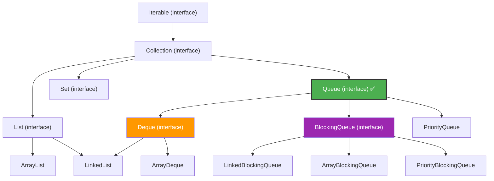
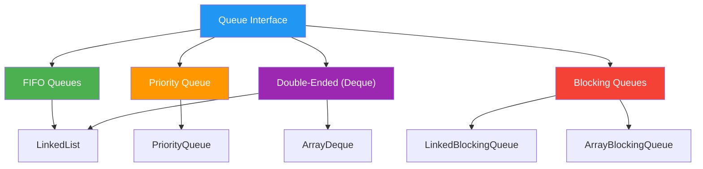
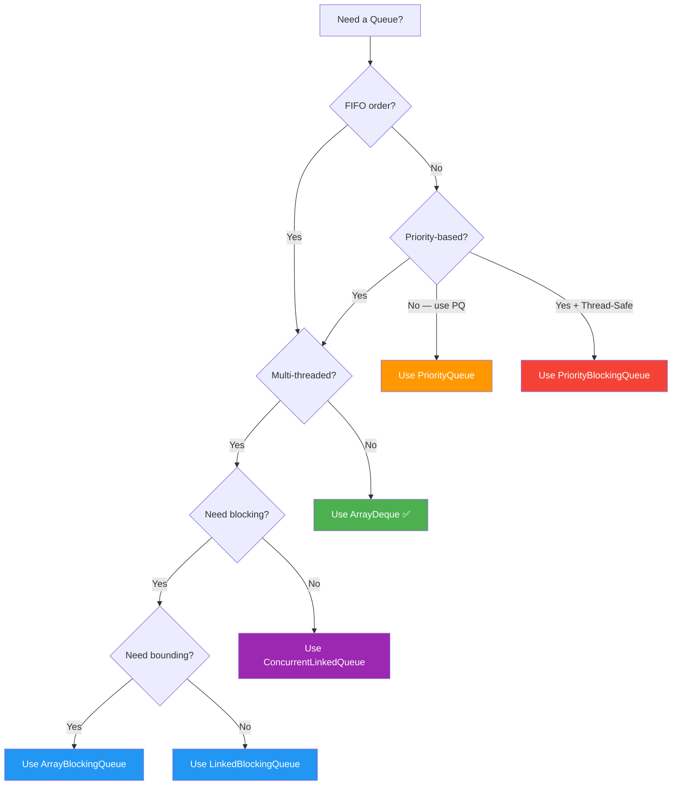

# Java Queue Collection — Complete Beginner-Friendly Notes

> Part of the [Java Collection Framework Notes](../README.md)
> **For:** Java learners preparing for interviews (beginner to intermediate).
> **Last Updated:** June 2026 | Java 21 LTS

---

## Table of Contents

1. [Introduction to Queue](#1-introduction-to-queue)
2. [Why Do We Need Queue?](#2-why-do-we-need-queue)
3. [Queue Interface Hierarchy](#3-queue-interface-hierarchy)
4. [Types of Queues in Java](#4-types-of-queues-in-java)
5. [Creating a Queue](#5-creating-a-queue)
6. [Queue Methods — Two Flavors](#6-queue-methods--two-flavors)
7. [Adding Elements](#7-adding-elements)
8. [Examining Elements (Peek)](#8-examining-elements-peek)
9. [Removing Elements (Poll)](#9-removing-elements-poll)
10. [Iterating Over a Queue](#10-iterating-over-a-queue)
11. [PriorityQueue — In-Depth](#11-priorityqueue--in-depth)
12. [ArrayDeque — In-Depth](#12-arraydeque--in-depth)
13. [Deque — Double-Ended Queue](#13-deque--double-ended-queue)
14. [Queue with Custom Objects](#14-queue-with-custom-objects)
15. [Null Handling](#15-null-handling)
16. [Thread Safety](#16-thread-safety)
17. [Performance — Time Complexity](#17-performance--time-complexity)
18. [Queue vs Stack vs List](#18-queue-vs-stack-vs-list)
19. [Practical Examples](#19-practical-examples)
20. [Best Practices](#20-best-practices)
21. [Interview Questions and Answers](#21-interview-questions-and-answers)
22. [Quick Reference Cheat Sheet](#22-quick-reference-cheat-sheet)
23. [Summary](#23r-summary)

---

## 1. Introduction to Queue

### What is a Queue?

A `Queue` is a collection designed for holding elements **before processing**. It follows the **FIFO** (First-In, First-Out) principle — the element that enters first is the one that leaves first.

It is part of the Java Collection Framework and lives in the `java.util` package.

```java
import java.util.LinkedList;
import java.util.Queue;

Queue<String> queue = new LinkedList<>();
queue.add("Alice");
queue.add("Bob");
queue.add("Charlie");

System.out.println(queue);
System.out.println(queue.poll());
System.out.println(queue);
```

Output:

```
[Alice, Bob, Charlie]
Alice
[Bob, Charlie]
```

### Simple Analogy

> **Queue** = A line of people at a ticket counter. The person who arrives first gets their ticket first. New people join at the back. The person at the front is served and leaves.
>
> **Stack (opposite)** = A stack of plates. The plate placed last is taken first (LIFO).

```
Queue (FIFO):    IN → [Charlie] [Bob] [Alice] → OUT
                        back              front
                 "Alice arrived first, so Alice leaves first."
```

### Key Properties at a Glance

| Property | Queue |
|---|---|
| Ordering principle | FIFO — First-In, First-Out |
| Part of Collections Framework | Yes — `java.util.Queue` interface |
| Allows duplicate elements | Yes |
| Allows null values | Depends on implementation (PriorityQueue — No, LinkedList — Yes) |
| Thread-safe | No (by default) |
| Common implementations | `LinkedList`, `PriorityQueue`, `ArrayDeque` |

---

## 2. Why Do We Need Queue?

### The Problem

Imagine you are building a system where tasks arrive and need to be processed **in order** — like print jobs, customer support tickets, or web server requests. You need a structure that:

- Holds items until they are processed
- Always processes the **oldest** item first
- Lets new items join at the back

A regular `ArrayList` can technically do this, but removing from the front is **slow** (O(n) — all elements shift). You need something designed for this exact use case.

### The Solution — Queue

Queue provides dedicated methods for inserting at the back and removing from the front — both in **O(1)** time.

```java
Queue<String> printJobs = new LinkedList<>();

// New print jobs arrive
printJobs.add("Document A");
printJobs.add("Document B");
printJobs.add("Document C");

// Process jobs in order (FIFO)
while (!printJobs.isEmpty()) {
    String job = printJobs.poll(); // removes from front
    System.out.println("Printing: " + job);
}
```

Output:

```
Printing: Document A
Printing: Document B
Printing: Document C
```

### Common Use Cases

| Use Case | Why Queue? |
|---|---|
| Printer queue | Jobs are printed in the order they arrive |
| Customer service | First caller gets served first |
| Task scheduling (OS) | CPU processes tasks in arrival order |
| Breadth-First Search (BFS) | Explores nodes level by level |
| Message queues (Kafka, RabbitMQ) | Messages processed in order |
| Rate limiting / throttling | Requests queued and released at a controlled rate |

> **Bottom line:** Whenever you need to process items in the order they arrive, use a Queue.

---

## 3. Queue Interface Hierarchy

### Where Does Queue Fit?

`Queue` is an **interface** — you cannot create an instance of it directly. You must use one of its implementations like `LinkedList`, `PriorityQueue`, or `ArrayDeque`.



> [!IMPORTANT]
> **Interview Point:** `Queue` is an **interface**, not a class. The most commonly used implementations are:
> - **`LinkedList`** — general-purpose FIFO queue
> - **`PriorityQueue`** — elements ordered by priority (natural order or Comparator)
> - **`ArrayDeque`** — fastest general-purpose queue/stack (preferred over LinkedList and Stack)

### Key Interfaces Extending Queue

| Interface | Purpose |
|---|---|
| `Queue<E>` | Basic FIFO operations |
| `Deque<E>` | Double-ended queue — add/remove from both ends |
| `BlockingQueue<E>` | Thread-safe queue with blocking operations (waits when empty/full) |

---

## 4. Types of Queues in Java

### Overview

Java provides several queue implementations, each designed for specific use cases.



### Comparison Table

| Implementation | Ordering | Bounded? | Null Allowed? | Thread-Safe? | Best For |
|---|---|---|---|---|---|
| `LinkedList` | FIFO (insertion order) | No | Yes | No | General-purpose queue |
| `PriorityQueue` | Priority (sorted order) | No | **No** | No | Processing by priority |
| `ArrayDeque` | FIFO or LIFO | No | **No** | No | Fast queue and stack |
| `LinkedBlockingQueue` | FIFO | Optional | **No** | Yes | Producer-consumer pattern |
| `ArrayBlockingQueue` | FIFO | Yes (fixed) | **No** | Yes | Bounded producer-consumer |
| `PriorityBlockingQueue` | Priority | No | **No** | Yes | Thread-safe priority processing |

### Simple Analogies for Each Type

> **LinkedList Queue** = A regular line at a ticket counter. First come, first served.
>
> **PriorityQueue** = A hospital emergency room. Patients are treated by severity, not arrival time. A heart attack patient gets treated before a headache patient, even if they arrived later.
>
> **ArrayDeque** = A double-door elevator. People can enter and exit from both the front and the back.
>
> **BlockingQueue** = A restaurant kitchen with a fixed-size order counter. If the counter is full, waiters wait. If the counter is empty, cooks wait.

---

## 5. Creating a Queue

You need to import it first:

```java
import java.util.Queue;
import java.util.LinkedList;
import java.util.PriorityQueue;
import java.util.ArrayDeque;
```

### Method 1 — Using LinkedList (most common for FIFO)

```java
Queue<String> queue = new LinkedList<>();
queue.add("Alice");
queue.add("Bob");
System.out.println(queue);
```

Output:

```
[Alice, Bob]
```

### Method 2 — Using ArrayDeque (fastest for general use)

```java
Queue<Integer> queue = new ArrayDeque<>();
queue.add(10);
queue.add(20);
queue.add(30);
System.out.println(queue);
```

Output:

```
[10, 20, 30]
```

### Method 3 — Using PriorityQueue (sorted by priority)

```java
Queue<Integer> pq = new PriorityQueue<>();
pq.add(30);
pq.add(10);
pq.add(20);

System.out.println(pq.poll()); // smallest first
System.out.println(pq.poll());
System.out.println(pq.poll());
```

Output:

```
10
20
30
```

> [!TIP]
> PriorityQueue does NOT store elements in sorted order internally. It uses a **heap** structure. Sorted order is only guaranteed when you **poll** (remove) elements one by one.

### Method 4 — From Another Collection

```java
List<String> names = List.of("Alice", "Bob", "Charlie");
Queue<String> queue = new LinkedList<>(names);
System.out.println(queue);
```

Output:

```
[Alice, Bob, Charlie]
```

### Best Practice — Declare as the Interface Type

```java
// PREFERRED — flexible
Queue<String> queue = new LinkedList<>();

// AVOID — locked to implementation
LinkedList<String> queue = new LinkedList<>();
```

**Why?** If you later switch to `ArrayDeque`, you only change one word in the preferred version.

---

## 6. Queue Methods — Two Flavors

This is one of the **most important things** to understand about Queue. Every core operation comes in **two versions**:

| Operation | Throws Exception (if fails) | Returns Special Value (if fails) |
|---|---|---|
| **Insert** | `add(e)` | `offer(e)` → returns `false` |
| **Remove** | `remove()` | `poll()` → returns `null` |
| **Examine** | `element()` | `peek()` → returns `null` |

### When to Use Which?

> **Analogy:** Think of a vending machine.
> - `add()` = Force-push a coin into the slot. If the machine is full, it **throws** the coin back at you (exception).
> - `offer()` = Gently try to insert a coin. If the machine is full, it just says "No thanks" and returns `false`.

```java
Queue<String> queue = new LinkedList<>();

// Both do the same thing for LinkedList (unbounded)
queue.add("Alice");
queue.offer("Bob");

System.out.println(queue);
```

Output:

```
[Alice, Bob]
```

> [!IMPORTANT]
> **Interview Point:** For **bounded queues** (like `ArrayBlockingQueue`), the difference matters:
> - `add()` throws `IllegalStateException` when the queue is full
> - `offer()` returns `false` when the queue is full
>
> For **unbounded queues** (like `LinkedList`, `PriorityQueue`), both behave identically.

### Summary Diagram

```
┌─────────────────────────────────────────────────────────────┐
│                    Queue Operations                         │
├─────────────┬──────────────────┬────────────────────────────┤
│  Operation  │  Throws Exception│  Returns null/false        │
├─────────────┼──────────────────┼────────────────────────────┤
│  Insert     │  add(e)          │  offer(e)                  │
│  Remove     │  remove()        │  poll()                    │
│  Examine    │  element()       │  peek()                    │
└─────────────┴──────────────────┴────────────────────────────┘
                      ↑                       ↑
              "I want an error          "I'll handle it
               if something              gracefully myself"
               goes wrong"
```

---

## 7. Adding Elements

### 🟢 `add(element)` — Throws Exception on Failure

| Property | Detail |
|---|---|
| **Syntax** | `boolean add(E e)` |
| **Description** | Inserts element at the **tail** of the queue |
| **Return Type** | `boolean` — always `true` for unbounded queues |
| **Throws** | `IllegalStateException` if queue is full (bounded queues) |
| **Time Complexity** | **O(1)** for LinkedList and ArrayDeque, **O(log n)** for PriorityQueue |

```java
Queue<String> queue = new LinkedList<>();
queue.add("Alice");
queue.add("Bob");
queue.add("Charlie");

System.out.println(queue);
```

Output:

```
[Alice, Bob, Charlie]
```

---

### 🟢 `offer(element)` — Returns false on Failure

| Property | Detail |
|---|---|
| **Syntax** | `boolean offer(E e)` |
| **Description** | Inserts element at the **tail** of the queue |
| **Return Type** | `boolean` — `true` if added, `false` if queue is full |
| **Time Complexity** | **O(1)** for LinkedList and ArrayDeque, **O(log n)** for PriorityQueue |

```java
Queue<String> queue = new LinkedList<>();
queue.offer("Alice");
queue.offer("Bob");

System.out.println(queue);
```

Output:

```
[Alice, Bob]
```

### When `offer()` Returns false — Bounded Queue Example

```java
import java.util.concurrent.ArrayBlockingQueue;

Queue<String> bounded = new ArrayBlockingQueue<>(2); // max 2 elements

System.out.println(bounded.offer("Alice"));   // true
System.out.println(bounded.offer("Bob"));     // true
System.out.println(bounded.offer("Charlie")); // false — queue is full!
System.out.println(bounded);
```

Output:

```
true
true
false
[Alice, Bob]
```

> If we had used `add("Charlie")` here, it would have thrown `IllegalStateException` instead of returning `false`.

---

## 8. Examining Elements (Peek)

Examining means **looking at the front element without removing it**.

### 🔵 `element()` — Throws Exception if Empty

| Property | Detail |
|---|---|
| **Syntax** | `E element()` |
| **Description** | Returns the **head** (front) element without removing it |
| **Return Type** | `E` |
| **Throws** | `NoSuchElementException` if queue is empty |
| **Time Complexity** | **O(1)** |

```java
Queue<String> queue = new LinkedList<>(List.of("Alice", "Bob", "Charlie"));

System.out.println(queue.element());
System.out.println(queue); // queue unchanged
```

Output:

```
Alice
[Alice, Bob, Charlie]
```

```java
Queue<String> empty = new LinkedList<>();
empty.element(); // CRASH! NoSuchElementException
```

---

### 🔵 `peek()` — Returns null if Empty

| Property | Detail |
|---|---|
| **Syntax** | `E peek()` |
| **Description** | Returns the **head** (front) element without removing it |
| **Return Type** | `E` or `null` if queue is empty |
| **Time Complexity** | **O(1)** |

```java
Queue<String> queue = new LinkedList<>(List.of("Alice", "Bob"));

System.out.println(queue.peek()); // Alice
System.out.println(queue);        // [Alice, Bob] — unchanged

Queue<String> empty = new LinkedList<>();
System.out.println(empty.peek()); // null — no exception!
```

Output:

```
Alice
[Alice, Bob]
null
```

> **Interview Tip:** Always prefer `peek()` over `element()` unless you specifically want an exception when the queue is empty.

---

## 9. Removing Elements (Poll)

Removing means **taking out the front element and returning it**.

### 🔴 `remove()` — Throws Exception if Empty

| Property | Detail |
|---|---|
| **Syntax** | `E remove()` |
| **Description** | Removes and returns the **head** (front) element |
| **Return Type** | `E` |
| **Throws** | `NoSuchElementException` if queue is empty |
| **Time Complexity** | **O(1)** for LinkedList and ArrayDeque, **O(log n)** for PriorityQueue |

```java
Queue<String> queue = new LinkedList<>(List.of("Alice", "Bob", "Charlie"));

System.out.println(queue.remove()); // Alice
System.out.println(queue);          // [Bob, Charlie]
```

Output:

```
Alice
[Bob, Charlie]
```

---

### 🔴 `poll()` — Returns null if Empty

| Property | Detail |
|---|---|
| **Syntax** | `E poll()` |
| **Description** | Removes and returns the **head** (front) element |
| **Return Type** | `E` or `null` if queue is empty |
| **Time Complexity** | **O(1)** for LinkedList and ArrayDeque, **O(log n)** for PriorityQueue |

```java
Queue<String> queue = new LinkedList<>(List.of("Alice", "Bob"));

System.out.println(queue.poll()); // Alice
System.out.println(queue.poll()); // Bob
System.out.println(queue.poll()); // null — queue is empty, no exception

System.out.println(queue);
```

Output:

```
Alice
Bob
null
[]
```

> **Interview Tip:** Always prefer `poll()` over `remove()` unless you specifically want an exception when the queue is empty.

### Processing All Elements — The Drain Pattern

A common pattern is to process all elements until the queue is empty:

```java
Queue<String> tasks = new LinkedList<>(List.of("Task A", "Task B", "Task C"));

while (!tasks.isEmpty()) {
    String task = tasks.poll();
    System.out.println("Processing: " + task);
}
```

Output:

```
Processing: Task A
Processing: Task B
Processing: Task C
```

### What Happens Inside (Visual)

```
Initial:    FRONT → [Alice] [Bob] [Charlie] ← BACK

poll():     FRONT → [Bob] [Charlie] ← BACK        (Alice removed)

poll():     FRONT → [Charlie] ← BACK               (Bob removed)

poll():     FRONT → [empty] ← BACK                  (Charlie removed)

poll():     returns null — queue is empty
```

---

## 10. Iterating Over a Queue

### Method 1 — Enhanced For-Each Loop

```java
Queue<String> queue = new LinkedList<>(List.of("Alice", "Bob", "Charlie"));

for (String name : queue) {
    System.out.println(name);
}
```

Output:

```
Alice
Bob
Charlie
```

> [!NOTE]
> The for-each loop does **NOT** remove elements. The queue remains unchanged after iteration.

### Method 2 — forEach with Lambda *(Java 8+)*

```java
queue.forEach(name -> System.out.println(name));

// Even shorter with method reference:
queue.forEach(System.out::println);
```

### Method 3 — Iterator

```java
Queue<String> queue = new LinkedList<>(List.of("Alice", "Bob", "Charlie"));

Iterator<String> it = queue.iterator();
while (it.hasNext()) {
    String name = it.next();
    System.out.println(name);
}
```

### Method 4 — Polling Until Empty *(destructive)*

This is the most "queue-like" way to iterate — it removes each element as it processes it.

```java
Queue<String> queue = new LinkedList<>(List.of("Alice", "Bob", "Charlie"));

while (!queue.isEmpty()) {
    System.out.println(queue.poll());
}

System.out.println("Queue after: " + queue);
```

Output:

```
Alice
Bob
Charlie
Queue after: []
```

> [!TIP]
> **Interview Point:** Use `poll()` in a while loop when you want to **consume** (drain) all elements. Use for-each when you want to **read** without modifying the queue.

### Quick Comparison

| Method | Removes Elements? | Best For |
|---|---|---|
| Enhanced for-each | No | Simple read-only iteration |
| forEach lambda | No | Clean one-liners |
| Iterator | Optional (with `it.remove()`) | Conditional removal during loop |
| poll() loop | Yes | Processing and consuming all items |

---

## 11. PriorityQueue — In-Depth

### What is PriorityQueue?

`PriorityQueue` is a queue where elements are **not** processed in FIFO order. Instead, they are processed by **priority** — the smallest (or highest-priority) element is always at the front.

```java
import java.util.PriorityQueue;

Queue<Integer> pq = new PriorityQueue<>();
pq.add(30);
pq.add(10);
pq.add(20);

System.out.println(pq);       // internal order — NOT sorted!
System.out.println(pq.poll()); // 10 — smallest comes out first
System.out.println(pq.poll()); // 20
System.out.println(pq.poll()); // 30
```

Output:

```
[10, 30, 20]
10
20
30
```

> [!IMPORTANT]
> **Critical Concept:** Printing a PriorityQueue does NOT show sorted order. The internal structure is a **min-heap**, which only guarantees that the smallest element is at the root. Elements come out in sorted order only when you **poll()** them one by one.

### Simple Analogy

> **PriorityQueue** = A hospital emergency room. Patients don't wait in the order they arrive. Instead, the most critical patient is always treated first, regardless of when they came in.

### How PriorityQueue Works Internally — Min-Heap

PriorityQueue uses a **binary min-heap** — a complete binary tree stored in an array where every parent is smaller than (or equal to) its children.

```
Adding: 30, 10, 20, 5, 15

Step-by-step heap construction:

After add(30):        After add(10):        After add(20):
      30                   10                    10
                          /                     /  \
                        30                    30    20

After add(5):         After add(15):
       5                    5
      / \                  / \
    10   20              10   20
    /                   /  \
  30                  30   15

Internal array: [5, 10, 20, 30, 15]
                 ↑
          always the minimum
```

### Heap Index Formula

The heap is stored in a flat array. The relationship between parent and children:

```
For element at index i:
  - Parent:      (i - 1) / 2
  - Left child:  2 * i + 1
  - Right child: 2 * i + 2

Array:  [ 5 | 10 | 20 | 30 | 15 ]
Index:    0    1    2    3    4

             5 (index 0)
            / \
    (idx 1) 10  20 (idx 2)
           / \
   (idx 3) 30  15 (idx 4)
```

### Natural Ordering (Min-Heap — Default)

By default, PriorityQueue orders elements using their **natural ordering** — numbers smallest-first, strings alphabetically.

```java
Queue<String> pq = new PriorityQueue<>();
pq.add("Banana");
pq.add("Apple");
pq.add("Cherry");

while (!pq.isEmpty()) {
    System.out.println(pq.poll());
}
```

Output:

```
Apple
Banana
Cherry
```

### Max-Heap — Reverse Ordering

To process the **largest** element first, provide a reverse comparator:

```java
Queue<Integer> maxHeap = new PriorityQueue<>(Comparator.reverseOrder());
maxHeap.add(10);
maxHeap.add(30);
maxHeap.add(20);

while (!maxHeap.isEmpty()) {
    System.out.println(maxHeap.poll());
}
```

Output:

```
30
20
10
```

### Custom Priority with Comparator

```java
// Priority by string length — shortest first
Queue<String> pq = new PriorityQueue<>(Comparator.comparingInt(String::length));
pq.add("Banana");
pq.add("Kiwi");
pq.add("Fig");
pq.add("Watermelon");

while (!pq.isEmpty()) {
    System.out.println(pq.poll());
}
```

Output:

```
Fig
Kiwi
Banana
Watermelon
```

### PriorityQueue Key Properties

| Property | Detail |
|---|---|
| **Internal structure** | Binary min-heap (stored as array) |
| **Default ordering** | Natural order (smallest first) |
| **Null allowed?** | **No** — throws `NullPointerException` |
| **Duplicates allowed?** | Yes |
| **Thread-safe?** | No (use `PriorityBlockingQueue` for thread safety) |
| **Initial capacity** | 11 (default) |
| **Growth** | Grows by 50% if size < 64, else by 25% |

---

## 12. ArrayDeque — In-Depth

### What is ArrayDeque?

`ArrayDeque` is a **resizable array** implementation of the `Deque` interface. It can work as both a **queue** (FIFO) and a **stack** (LIFO) — and it is faster than both `LinkedList` and `Stack` for these purposes.

```java
import java.util.ArrayDeque;
import java.util.Queue;

Queue<String> queue = new ArrayDeque<>();
queue.add("Alice");
queue.add("Bob");
queue.add("Charlie");

System.out.println(queue.poll()); // Alice — FIFO
System.out.println(queue);
```

Output:

```
Alice
[Bob, Charlie]
```

### Simple Analogy

> **ArrayDeque** = A circular conveyor belt at an airport baggage claim. Bags go on at one end and come off at the other. The belt is circular — when the end is reached, it wraps around to use empty space at the beginning.

### How ArrayDeque Works Internally — Circular Array

ArrayDeque uses a **circular (ring) buffer** — an array with two pointers (`head` and `tail`) that wrap around.

```
Initial state (capacity = 8):
┌─────┬─────┬─────┬─────┬─────┬─────┬─────┬─────┐
│     │     │     │     │     │     │     │     │
└─────┴─────┴─────┴─────┴─────┴─────┴─────┴─────┘
  h/t

After add("A"), add("B"), add("C"):
┌─────┬─────┬─────┬─────┬─────┬─────┬─────┬─────┐
│  A  │  B  │  C  │     │     │     │     │     │
└─────┴─────┴─────┴─────┴─────┴─────┴─────┴─────┘
  h              t

After poll() — removes "A":
┌─────┬─────┬─────┬─────┬─────┬─────┬─────┬─────┐
│     │  B  │  C  │     │     │     │     │     │
└─────┴─────┴─────┴─────┴─────┴─────┴─────┴─────┘
         h        t

After wrapping around (many adds and polls):
┌─────┬─────┬─────┬─────┬─────┬─────┬─────┬─────┐
│  G  │  H  │     │     │     │  D  │  E  │  F  │
└─────┴─────┴─────┴─────┴─────┴─────┴─────┴─────┘
              t                  h
          ← tail wraps around to beginning
```

> [!NOTE]
> Unlike `ArrayList` which shifts elements on removal, `ArrayDeque` just moves the `head` pointer forward. This is why both add and remove are **O(1)**.

### ArrayDeque vs LinkedList — Which to Use?

| Feature | ArrayDeque | LinkedList |
|---|---|---|
| Internal structure | Circular array | Doubly linked nodes |
| Memory per element | Low (~1 reference) | High (~3 references + node object) |
| CPU cache performance | **Excellent** (contiguous memory) | Poor (nodes scattered in memory) |
| Speed (add/remove ends) | **Faster** in practice | Slower due to cache misses |
| Null elements | **Not allowed** | Allowed |
| Use as Queue | **Preferred** ✅ | Works but slower |
| Use as Stack | **Preferred** ✅ | Works but slower |
| Use as List | No | Yes (implements `List`) |

> [!TIP]
> **Interview Point:** The Java documentation itself recommends `ArrayDeque` over `LinkedList` for queue and stack operations. Use `LinkedList` only when you need `List` interface features (like index-based access) or need to store `null` values.

### ArrayDeque Key Properties

| Property | Detail |
|---|---|
| **Internal structure** | Circular resizable array |
| **Null allowed?** | **No** — throws `NullPointerException` |
| **Duplicates?** | Yes |
| **Thread-safe?** | No |
| **Initial capacity** | 16 (default, always a power of 2) |
| **Growth** | Doubles when full |

---

## 13. Deque — Double-Ended Queue

### What is Deque?

`Deque` (pronounced "deck") stands for **Double-Ended Queue**. It extends `Queue` and allows insertion and removal from **both ends** — front and back.

```java
import java.util.ArrayDeque;
import java.util.Deque;

Deque<String> deque = new ArrayDeque<>();

deque.addFirst("B");
deque.addFirst("A");   // added to front
deque.addLast("C");    // added to back

System.out.println(deque);
```

Output:

```
[A, B, C]
```

### Deque as Queue (FIFO) vs Deque as Stack (LIFO)

```
As Queue (FIFO):
  addLast()  → [ A | B | C ] → removeFirst()
  "Elements enter from back, exit from front"

As Stack (LIFO):
  push() (addFirst) → [ C | B | A ]
  pop()  (removeFirst) → removes C first
  "Elements enter and exit from the same end (front)"
```

### Deque Method Summary

| Operation | First Element (Head) | Last Element (Tail) |
|---|---|---|
| **Insert** | `addFirst(e)` / `offerFirst(e)` | `addLast(e)` / `offerLast(e)` |
| **Remove** | `removeFirst()` / `pollFirst()` | `removeLast()` / `pollLast()` |
| **Examine** | `getFirst()` / `peekFirst()` | `getLast()` / `peekLast()` |

### Queue-Equivalent and Stack-Equivalent Methods

| Queue Method | Equivalent Deque Method |
|---|---|
| `add(e)` | `addLast(e)` |
| `offer(e)` | `offerLast(e)` |
| `remove()` | `removeFirst()` |
| `poll()` | `pollFirst()` |
| `element()` | `getFirst()` |
| `peek()` | `peekFirst()` |

| Stack Method | Equivalent Deque Method |
|---|---|
| `push(e)` | `addFirst(e)` |
| `pop()` | `removeFirst()` |
| `peek()` | `peekFirst()` |

### Practical Example — Using Deque as Both Queue and Stack

```java
Deque<String> deque = new ArrayDeque<>();

// Use as Queue (FIFO)
deque.offerLast("Task 1");
deque.offerLast("Task 2");
deque.offerLast("Task 3");
System.out.println("Queue poll: " + deque.pollFirst()); // Task 1

// Use as Stack (LIFO)
deque.push("Urgent Task");
System.out.println("Stack pop: " + deque.pop()); // Urgent Task

System.out.println("Remaining: " + deque);
```

Output:

```
Queue poll: Task 1
Stack pop: Urgent Task
Remaining: [Task 2, Task 3]
```

> [!IMPORTANT]
> **Interview Point:** Always use `Deque` (specifically `ArrayDeque`) instead of the legacy `Stack` class. The `Stack` class extends `Vector`, which synchronizes every method — making it slow. `ArrayDeque` is much faster.

---

## 14. Queue with Custom Objects

### Basic Example — Task Processing

```java
class Task {
    String name;
    int priority;

    Task(String name, int priority) {
        this.name = name;
        this.priority = priority;
    }

    public String toString() {
        return name + " (priority: " + priority + ")";
    }
}

Queue<Task> taskQueue = new LinkedList<>();
taskQueue.add(new Task("Send Email", 2));
taskQueue.add(new Task("Fix Bug", 1));
taskQueue.add(new Task("Write Docs", 3));

while (!taskQueue.isEmpty()) {
    System.out.println("Processing: " + taskQueue.poll());
}
```

Output:

```
Processing: Send Email (priority: 2)
Processing: Fix Bug (priority: 1)
Processing: Write Docs (priority: 3)
```

> Note: With `LinkedList`, tasks are processed in **insertion order** (FIFO), not by priority.

### PriorityQueue with Custom Objects

To use `PriorityQueue` with custom objects, you must provide a **Comparator** or implement `Comparable`.

**Method 1 — Comparator:**

```java
Queue<Task> pq = new PriorityQueue<>(Comparator.comparingInt(t -> t.priority));
pq.add(new Task("Send Email", 2));
pq.add(new Task("Fix Bug", 1));
pq.add(new Task("Write Docs", 3));

while (!pq.isEmpty()) {
    System.out.println("Processing: " + pq.poll());
}
```

Output:

```
Processing: Fix Bug (priority: 1)
Processing: Send Email (priority: 2)
Processing: Write Docs (priority: 3)
```

**Method 2 — Implementing Comparable:**

```java
class Task implements Comparable<Task> {
    String name;
    int priority;

    Task(String name, int priority) {
        this.name = name;
        this.priority = priority;
    }

    @Override
    public int compareTo(Task other) {
        return Integer.compare(this.priority, other.priority);
    }

    public String toString() {
        return name + " (priority: " + priority + ")";
    }
}

Queue<Task> pq = new PriorityQueue<>();
pq.add(new Task("Deploy", 3));
pq.add(new Task("Hotfix", 1));
pq.add(new Task("Review", 2));

while (!pq.isEmpty()) {
    System.out.println(pq.poll());
}
```

Output:

```
Hotfix (priority: 1)
Review (priority: 2)
Deploy (priority: 3)
```

> [!IMPORTANT]
> **Interview Point:** If you add objects to `PriorityQueue` without a `Comparator` and the class doesn't implement `Comparable`, you get `ClassCastException` at runtime.

---

## 15. Null Handling

Null handling varies **by implementation**:

| Implementation | Allows null? | Why? |
|---|---|---|
| `LinkedList` | ✅ Yes | No restrictions |
| `PriorityQueue` | ❌ **No** | Cannot compare `null` (how do you rank it?) |
| `ArrayDeque` | ❌ **No** | `null` is used internally as a sentinel value |
| `ArrayBlockingQueue` | ❌ **No** | `null` is used as poison pill/sentinel |

### Examples

```java
// LinkedList — allows null
Queue<String> ll = new LinkedList<>();
ll.add(null);  // OK
ll.add("Bob");
System.out.println(ll); // [null, Bob]
```

```java
// PriorityQueue — throws NullPointerException
Queue<String> pq = new PriorityQueue<>();
pq.add("Alice");
pq.add(null); // CRASH! NullPointerException
```

```java
// ArrayDeque — throws NullPointerException
Queue<String> ad = new ArrayDeque<>();
ad.add(null); // CRASH! NullPointerException
```

> [!WARNING]
> **Best Practice:** Avoid adding `null` to any queue, even if the implementation allows it. When `poll()` returns `null`, you cannot tell if the queue was empty or if it contained `null`. This creates confusing bugs.

---

## 16. Thread Safety

**Queues are NOT thread-safe by default.** If multiple threads read and write to the same queue at the same time, data can become corrupted.

### For Single-Threaded Programs

Just use `ArrayDeque` or `LinkedList` normally. No issues.

### For Multi-Threaded Programs

**Option 1: `BlockingQueue` implementations (recommended)**

```java
// Thread-safe with blocking
BlockingQueue<String> queue = new LinkedBlockingQueue<>();
queue.put("item");          // blocks if full
String item = queue.take(); // blocks if empty
```

**Option 2: `ConcurrentLinkedQueue` (non-blocking, thread-safe)**

```java
Queue<String> queue = new ConcurrentLinkedQueue<>();
queue.offer("Alice");
queue.offer("Bob");
System.out.println(queue.poll()); // Alice

// Safe for multiple threads — lock-free implementation
```

**Option 3: `Collections.synchronizedQueue()` — Not Available!**

> [!WARNING]
> Unlike `synchronizedList()`, there is **no** `Collections.synchronizedQueue()`. For thread-safe queues, you must use the concurrent implementations from `java.util.concurrent`.

### Quick Guide

| Scenario | Use |
|---|---|
| Single-threaded code | `ArrayDeque` |
| Multi-threaded, need blocking | `LinkedBlockingQueue` or `ArrayBlockingQueue` |
| Multi-threaded, non-blocking | `ConcurrentLinkedQueue` |
| Priority + thread-safe | `PriorityBlockingQueue` |

---

## 17. Performance — Time Complexity

### LinkedList (as Queue)

| Operation | Time | Why |
|---|---|---|
| `add(e)` / `offer(e)` | **O(1)** | Appends to tail pointer |
| `remove()` / `poll()` | **O(1)** | Removes from head pointer |
| `element()` / `peek()` | **O(1)** | Reads head pointer |
| `contains(e)` | **O(n)** | Must scan all nodes |
| `size()` | **O(1)** | Stored as a field |

### ArrayDeque (as Queue)

| Operation | Time | Why |
|---|---|---|
| `add(e)` / `offer(e)` | **O(1)** amortized | O(n) on rare resize |
| `remove()` / `poll()` | **O(1)** | Moves head index |
| `element()` / `peek()` | **O(1)** | Direct array access |
| `contains(e)` | **O(n)** | Scans array |
| `size()` | **O(1)** | Computed from head/tail |

### PriorityQueue

| Operation | Time | Why |
|---|---|---|
| `add(e)` / `offer(e)` | **O(log n)** | Heap sift-up |
| `remove()` / `poll()` | **O(log n)** | Heap sift-down |
| `element()` / `peek()` | **O(1)** | Root is always min/max |
| `contains(e)` | **O(n)** | Linear scan |
| `remove(Object)` | **O(n)** | Linear scan + sift |

### Performance Comparison Visual

```
Operation Speed (smaller = faster):

          add/offer    poll/remove    peek
          ─────────    ───────────    ────
ArrayDeque    ★            ★           ★     ← FASTEST overall
LinkedList    ★            ★           ★     ← Equal O(1) but slower in practice
PriorityQ     ★★           ★★          ★     ← O(log n) insert/remove

★   = O(1)
★★  = O(log n)
★★★ = O(n)
```

> **Interview Tip:** `ArrayDeque` is faster than `LinkedList` for queue operations because array elements are stored in contiguous memory (better CPU cache utilization). `LinkedList` nodes are scattered across memory, causing frequent cache misses.

---

## 18. Queue vs Stack vs List

| Feature | Queue | Stack (Deque) | List |
|---|---|---|---|
| Ordering | FIFO | LIFO | By index |
| Add | At back (`offer`) | At top (`push`) | At any index (`add`) |
| Remove | From front (`poll`) | From top (`pop`) | From any index (`remove`) |
| Access | Front only (`peek`) | Top only (`peek`) | Any index (`get`) |
| Best implementation | `ArrayDeque` | `ArrayDeque` | `ArrayList` |
| Use case | Task scheduling, BFS | Undo/redo, DFS | General-purpose storage |

### Visual Comparison

```
Queue (FIFO):
  IN → [C] [B] [A] → OUT
  "First in, first out — like a line"

Stack (LIFO):
       ↕ IN/OUT
      [C]  ← top
      [B]
      [A]
  "Last in, first out — like a stack of plates"

List (Indexed):
  [A] [B] [C] [D] [E]
   0   1   2   3   4
  "Access any position by index"
```

---

## 19. Practical Examples

### Example 1 — Printer Queue

```java
Queue<String> printerQueue = new ArrayDeque<>();
printerQueue.add("Report.pdf");
printerQueue.add("Invoice.pdf");
printerQueue.add("Photo.jpg");

System.out.println("Print queue: " + printerQueue);

while (!printerQueue.isEmpty()) {
    System.out.println("Printing: " + printerQueue.poll());
}

System.out.println("All jobs done!");
```

Output:

```
Print queue: [Report.pdf, Invoice.pdf, Photo.jpg]
Printing: Report.pdf
Printing: Invoice.pdf
Printing: Photo.jpg
All jobs done!
```

### Example 2 — Breadth-First Search (BFS)

BFS is one of the **most common** uses of a queue in programming.

```java
import java.util.*;

public class BFSExample {
    public static void main(String[] args) {
        // Simple graph represented as adjacency list
        Map<String, List<String>> graph = new HashMap<>();
        graph.put("A", List.of("B", "C"));
        graph.put("B", List.of("D", "E"));
        graph.put("C", List.of("F"));
        graph.put("D", List.of());
        graph.put("E", List.of());
        graph.put("F", List.of());

        // BFS traversal
        Queue<String> queue = new ArrayDeque<>();
        Set<String> visited = new HashSet<>();

        queue.add("A");
        visited.add("A");

        while (!queue.isEmpty()) {
            String node = queue.poll();
            System.out.print(node + " ");

            for (String neighbor : graph.get(node)) {
                if (!visited.contains(neighbor)) {
                    visited.add(neighbor);
                    queue.add(neighbor);
                }
            }
        }
    }
}
```

Output:

```
A B C D E F
```

```
BFS explores level by level:
Level 0:     [A]
Level 1:     [B, C]
Level 2:     [D, E, F]

Queue state at each step:
  Start:  [A]
  Visit A: [B, C]        ← add A's neighbors
  Visit B: [C, D, E]     ← add B's neighbors
  Visit C: [D, E, F]     ← add C's neighbors
  Visit D: [E, F]
  Visit E: [F]
  Visit F: []             ← done!
```

### Example 3 — Hot Potato Game (Circular Queue Simulation)

```java
Queue<String> circle = new LinkedList<>(
    List.of("Alice", "Bob", "Charlie", "Dave", "Eve")
);

int passes = 0;
while (circle.size() > 1) {
    passes++;
    if (passes % 3 == 0) {
        String eliminated = circle.poll();
        System.out.println(eliminated + " is eliminated!");
    } else {
        circle.add(circle.poll()); // move to back of line
    }
}

System.out.println("Winner: " + circle.poll());
```

Output:

```
Charlie is eliminated!
Alice is eliminated!
Eve is eliminated!
Bob is eliminated!
Winner: Dave
```

### Example 4 — Recent Calls Counter

```java
class RecentCounter {
    Queue<Integer> queue;

    RecentCounter() {
        queue = new LinkedList<>();
    }

    int ping(int t) {
        queue.add(t);
        // Remove calls older than 3000ms
        while (queue.peek() < t - 3000) {
            queue.poll();
        }
        return queue.size();
    }
}

RecentCounter counter = new RecentCounter();
System.out.println(counter.ping(1));      // 1
System.out.println(counter.ping(100));    // 2
System.out.println(counter.ping(3001));   // 3
System.out.println(counter.ping(3002));   // 3 (call at time 1 dropped)
```

Output:

```
1
2
3
3
```

### Example 5 — Task Scheduler with Priority

```java
class Task implements Comparable<Task> {
    String name;
    int priority; // lower = more urgent

    Task(String name, int priority) {
        this.name = name;
        this.priority = priority;
    }

    @Override
    public int compareTo(Task other) {
        return Integer.compare(this.priority, other.priority);
    }

    public String toString() {
        return name + " [P" + priority + "]";
    }
}

Queue<Task> scheduler = new PriorityQueue<>();
scheduler.add(new Task("Write report", 3));
scheduler.add(new Task("Fix critical bug", 1));
scheduler.add(new Task("Code review", 2));
scheduler.add(new Task("Server is down!", 0));

System.out.println("Processing tasks by priority:");
while (!scheduler.isEmpty()) {
    System.out.println("  → " + scheduler.poll());
}
```

Output:

```
Processing tasks by priority:
  → Server is down! [P0]
  → Fix critical bug [P1]
  → Code review [P2]
  → Write report [P3]
```

---

## 20. Best Practices

### Do

1. **Use `ArrayDeque` as your default queue** — it is faster than `LinkedList` for both queue and stack operations.
2. **Declare as the interface type** — `Queue<String>` instead of `ArrayDeque<String>`.
3. **Prefer `offer()`/`poll()`/`peek()`** over `add()`/`remove()`/`element()` — they handle failures gracefully instead of throwing exceptions.
4. **Use `PriorityQueue` only when order matters** — don't use it as a regular FIFO queue.
5. **Use `BlockingQueue` for producer-consumer patterns** — don't try to build thread-safe queues manually.
6. **Use `poll()` loop for draining** — `while (!queue.isEmpty()) { queue.poll(); }` is the idiomatic pattern.
7. **Provide a Comparator for custom objects in PriorityQueue** — otherwise you'll get `ClassCastException`.

```java
// GOOD — graceful failure handling
Queue<String> queue = new ArrayDeque<>();
String item = queue.poll(); // returns null if empty
if (item != null) {
    process(item);
}
```

### Don't

1. **Don't add `null` to queues** — most implementations reject it, and even where allowed, it causes ambiguity with `poll()` return values.
2. **Don't iterate over PriorityQueue expecting sorted order** — it's a heap, not a sorted list. Only `poll()` gives sorted results.
3. **Don't use the legacy `Stack` class** — use `ArrayDeque` instead.
4. **Don't use `LinkedList` as a queue when `ArrayDeque` will do** — `ArrayDeque` is faster in practice.
5. **Don't share a regular queue between threads** — use `ConcurrentLinkedQueue` or `BlockingQueue`.
6. **Don't assume `PriorityQueue.toString()` shows sorted order** — it does not.

---

## 21. Interview Questions and Answers

**Q1. What is a Queue in Java?**

> Queue is an interface in `java.util` that represents a collection designed for holding elements prior to processing. It typically follows FIFO (First-In, First-Out) ordering, where elements are inserted at the tail and removed from the head.

---

**Q2. What is the difference between `add()` and `offer()` in Queue?**

> Both insert an element into the queue. The difference appears with **bounded queues**: `add()` throws `IllegalStateException` if the queue is full, while `offer()` returns `false`. For unbounded queues (like `LinkedList`), they behave identically.

---

**Q3. What is the difference between `poll()` and `remove()` in Queue?**

> Both remove and return the head element. The difference: `remove()` throws `NoSuchElementException` if the queue is empty, while `poll()` returns `null`. In production code, `poll()` is generally preferred.

---

**Q4. What is the difference between `peek()` and `element()` in Queue?**

> Both return the head element without removing it. `element()` throws `NoSuchElementException` if the queue is empty, while `peek()` returns `null`.

---

**Q5. What are the main implementations of Queue in Java?**

> - `LinkedList` — general-purpose FIFO queue
> - `PriorityQueue` — elements ordered by priority (min-heap)
> - `ArrayDeque` — fastest queue/stack (circular array)
> - `LinkedBlockingQueue` — thread-safe, optionally bounded
> - `ArrayBlockingQueue` — thread-safe, fixed capacity
> - `ConcurrentLinkedQueue` — thread-safe, non-blocking

---

**Q6. Can Queue contain null elements?**

> It depends on the implementation. `LinkedList` allows null. `PriorityQueue`, `ArrayDeque`, and all `BlockingQueue` implementations do **not** allow null. It is generally best practice to avoid adding null to any queue.

---

**Q7. What is PriorityQueue and how does it work internally?**

> `PriorityQueue` orders elements by their natural ordering or a custom Comparator. Internally, it uses a **binary min-heap** stored as an array. The smallest element is always at the root (index 0). `add()` and `poll()` take O(log n) time due to heap sift operations.

---

**Q8. Does PriorityQueue maintain sorted order?**

> No. `PriorityQueue` is a **heap**, not a sorted list. Only the **minimum** element is guaranteed to be at the head. Iterating or printing does NOT produce sorted output. To get elements in sorted order, you must `poll()` them one by one.

---

**Q9. What is the difference between Queue and Deque?**

> `Queue` supports insertion at the tail and removal from the head (FIFO). `Deque` (extends Queue) supports insertion and removal from **both** ends. Deque can act as both a queue (FIFO) and a stack (LIFO).

---

**Q10. Why should we use ArrayDeque instead of Stack?**

> The `Stack` class extends `Vector`, which synchronizes every method — making it slow even in single-threaded code. `ArrayDeque` is not synchronized, uses a more efficient circular array, and is recommended by Java's own documentation as the replacement for `Stack`.

---

**Q11. What is BlockingQueue and when should you use it?**

> `BlockingQueue` is a thread-safe queue interface from `java.util.concurrent`. It provides blocking operations: `put()` blocks when the queue is full, `take()` blocks when empty. Use it for producer-consumer patterns where threads need to coordinate safely.

---

**Q12. What is the time complexity of PriorityQueue operations?**

> - `offer()` / `add()`: O(log n) — heap sift-up
> - `poll()` / `remove()`: O(log n) — heap sift-down
> - `peek()`: O(1) — root element
> - `contains()`: O(n) — linear scan
> - `remove(Object)`: O(n) — linear scan + O(log n) sift

---

**Q13. What is the difference between ArrayDeque and LinkedList for queue operations?**

> Both support O(1) add and remove at both ends. However, `ArrayDeque` is faster in practice because its elements are stored in a contiguous array (better CPU cache utilization). `LinkedList` nodes are scattered across memory, causing cache misses. `ArrayDeque` also uses less memory per element. Use `LinkedList` only if you need `List` interface features or null elements.

---

**Q14. What is a circular array and how does ArrayDeque use it?**

> A circular array treats the array as if the end wraps around to the beginning. `ArrayDeque` uses two indices — `head` and `tail` — that wrap around using modulo arithmetic. This avoids shifting elements on removal. When the array is full, it doubles in size and re-copies elements.

---

**Q15. Can you sort a Queue?**

> There's no direct `sort()` method on Queue. You can:
> 1. Convert to a List, sort it, and recreate the queue
> 2. Use a `PriorityQueue` which maintains heap order
> 3. Drain the queue into a `TreeSet` or sorted list

---

**Q16. What is the difference between `ConcurrentLinkedQueue` and `LinkedBlockingQueue`?**

> `ConcurrentLinkedQueue` is an unbounded, non-blocking, lock-free queue. It never blocks — operations return immediately. `LinkedBlockingQueue` supports blocking operations (`put()`/`take()`) and can be optionally bounded. Use `ConcurrentLinkedQueue` when blocking is not needed; use `LinkedBlockingQueue` for producer-consumer with backpressure.

---

**Q17. How does Queue differ from List?**

> `Queue` is designed for holding-before-processing (FIFO). It provides specialized methods (`offer`, `poll`, `peek`) and restricts access to the head. `List` allows random access by index and supports insertion/removal at any position. Queue is more restrictive by design — that's its strength.

---

**Q18. What happens if you add an element to a full ArrayBlockingQueue using `add()` vs `offer()` vs `put()`?**

> - `add()`: throws `IllegalStateException`
> - `offer()`: returns `false` immediately
> - `put()`: **blocks** the calling thread until space becomes available
> - `offer(e, timeout, unit)`: blocks for the specified timeout, then returns `false` if still full

---

**Q19. Is PriorityQueue thread-safe?**

> No. For thread-safe priority processing, use `PriorityBlockingQueue` from `java.util.concurrent`.

---

**Q20. What is the default capacity of PriorityQueue and ArrayDeque?**

> - `PriorityQueue`: default initial capacity is **11**
> - `ArrayDeque`: default initial capacity is **16** (always a power of 2)
> Both grow automatically when full — PriorityQueue by ~50% (or 25% if large), ArrayDeque by doubling.

---

## 22. Quick Reference Cheat Sheet

```java
import java.util.*;

// ── CREATE ──────────────────────────────────────────────────────
Queue<String> q1 = new LinkedList<>();                     // FIFO queue
Queue<String> q2 = new ArrayDeque<>();                     // fast FIFO queue
Queue<Integer> q3 = new PriorityQueue<>();                 // min-heap
Queue<Integer> q4 = new PriorityQueue<>(Comparator.reverseOrder()); // max-heap
Queue<String> q5 = new PriorityQueue<>(Comparator.comparing(String::length)); // custom

// ── INSERT (at tail) ────────────────────────────────────────────
queue.add("item");        // throws exception if full      O(1) / O(log n)
queue.offer("item");      // returns false if full         O(1) / O(log n)

// ── EXAMINE (head, no removal) ──────────────────────────────────
String head = queue.element();  // throws if empty         O(1)
String head = queue.peek();     // returns null if empty   O(1)

// ── REMOVE (from head) ─────────────────────────────────────────
String item = queue.remove();   // throws if empty         O(1) / O(log n)
String item = queue.poll();     // returns null if empty   O(1) / O(log n)

// ── SIZE & CHECK ────────────────────────────────────────────────
int sz    = queue.size();        // count                  O(1)
boolean e = queue.isEmpty();     // empty check            O(1)
boolean f = queue.contains("x"); // search                 O(n)

// ── ITERATE ─────────────────────────────────────────────────────
for (String s : queue) { }                                 // read-only
queue.forEach(System.out::println);                        // lambda
while (!queue.isEmpty()) { queue.poll(); }                 // drain

// ── DEQUE OPERATIONS (ArrayDeque/LinkedList) ────────────────────
Deque<String> deque = new ArrayDeque<>();
deque.addFirst("A");           // insert at front          O(1)
deque.addLast("B");            // insert at back           O(1)
deque.removeFirst();           // remove from front        O(1)
deque.removeLast();            // remove from back         O(1)
deque.peekFirst();             // examine front            O(1)
deque.peekLast();              // examine back             O(1)

// ── STACK OPERATIONS (ArrayDeque) ───────────────────────────────
Deque<String> stack = new ArrayDeque<>();
stack.push("item");            // push to top (addFirst)   O(1)
String top = stack.pop();      // pop from top             O(1)
String look = stack.peek();    // peek top                 O(1)

// ── CONVERT ─────────────────────────────────────────────────────
List<String> list = new ArrayList<>(queue);                // queue → list
Queue<String> q = new LinkedList<>(list);                  // list → queue
```

---

## 23. Summary

```
Queue Collection in a Nutshell:
━━━━━━━━━━━━━━━━━━━━━━━━━━━━━━━━━━━━━━━━━━━━━━━━━━━━━━━━━━━━━━
  1. Queue is an interface for FIFO (First-In, First-Out) processing.
  2. Core methods come in pairs: add/offer, remove/poll, element/peek.
  3. ArrayDeque is the fastest general-purpose queue and stack.
  4. PriorityQueue processes elements by priority (min-heap internally).
  5. LinkedList works as a queue but ArrayDeque is preferred.
  6. BlockingQueue is for thread-safe producer-consumer patterns.
  7. Most implementations do NOT allow null values.
  8. PriorityQueue does NOT iterate in sorted order — only poll() does.
━━━━━━━━━━━━━━━━━━━━━━━━━━━━━━━━━━━━━━━━━━━━━━━━━━━━━━━━━━━━━━
```

**When to use Queue:**
- You need to process elements in the order they arrive (FIFO).
- You are implementing BFS, task scheduling, or message processing.
- You need a thread-safe producer-consumer pattern (BlockingQueue).
- You need to process items by priority (PriorityQueue).

**When NOT to use Queue:**
- You need random access by index → use `ArrayList`.
- You need to store unique elements → use `HashSet`.
- You need key-value mapping → use `HashMap`.
- You need sorted iteration → use `TreeSet` or sort a `List`.

### Choosing the Right Queue Implementation



---

*Part of [Java Collection Framework Notes](../README.md).*
