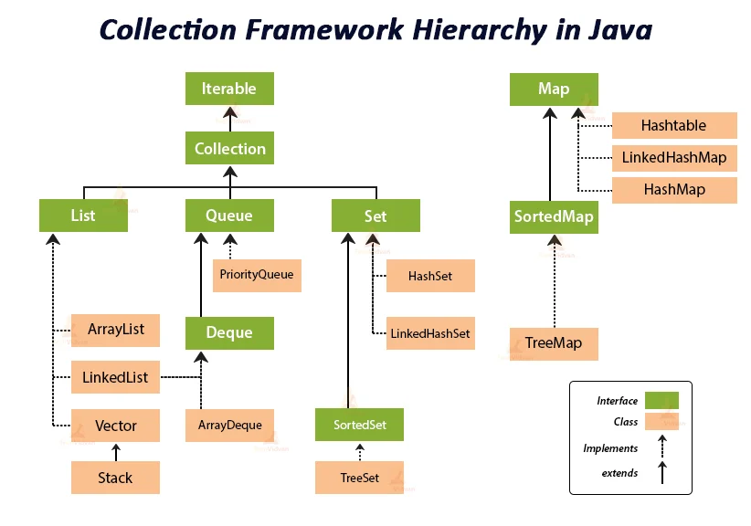

# Java Collection Framework — Complete Beginner-Friendly Notes

> **For:** Java learners preparing for interviews (beginner to intermediate).
> **Last Updated:** June 2026 | Java 21 LTS

---

## Table of Contents

- [1. What is the Java Collection Framework?](#1-what-is-the-java-collection-framework)
- [2. Why Does JCF Exist?](#2-why-does-jcf-exist)
- [3. JCF Hierarchy](#3-jcf-hierarchy)
- [4. Core Interfaces](#4-core-interfaces)
- [5. Core Concepts Before You Code](#5-core-concepts-before-you-code)
  - [5.1 Generics](#51-generics)
  - [5.2 Autoboxing and Unboxing](#52-autoboxing-and-unboxing)
  - [5.3 equals() and hashCode()](#53-equals-and-hashcode)
  - [5.4 Comparable vs Comparator](#54-comparable-vs-comparator)
  - [5.5 Iterator Pattern](#55-iterator-pattern)
  - [5.6 Fail-Fast vs Fail-Safe Iterators](#56-fail-fast-vs-fail-safe-iterators)
  - [5.7 Immutability](#57-immutability)

---

## 1. What is the Java Collection Framework?

### In Simple Words

Imagine you are cooking and you need containers — bowls, jars, trays — to hold different ingredients. You *could* build them yourself from clay, but why would you when a fully stocked kitchen is already waiting?

The **Java Collection Framework (JCF)** is that kitchen. It is a set of ready-made classes and interfaces for storing, retrieving, and manipulating groups of objects. It lives in the `java.util` package and has been part of Java since **version 1.2 (1998)**.

### Why Do We Need It?

Without JCF, every time you needed a list, a set, or a lookup table, you would have to build one from scratch. Every developer would do it differently, bugs would be everywhere, and sharing code between teams would be a nightmare.

JCF gives everyone the **same high-quality, battle-tested tools** so you can focus on solving your actual problem instead of reinventing basic data structures.

### The Toolbox Analogy

> Think of JCF as a **professional toolbox**.
>
> Before JCF, every carpenter had to forge their own hammer, saw, and screwdriver from raw metal. It worked, but it was slow and no two carpenters' tools were compatible.
>
> JCF handed every Java developer the same reliable set of tools. You just pick the right one for the job and start building.

```
JCF = Toolbox

  [ ArrayList  ]  →  Resizable list with numbered slots
  [ LinkedList ]  →  Chain of connected items
  [ HashMap    ]  →  Labeled file cabinet (key → value)
  [ HashSet    ]  →  Bag that rejects duplicates
  [ TreeMap    ]  →  Alphabetically sorted file cabinet
  [ Queue      ]  →  Ticket counter — first come, first served
```

### The Three Pillars of JCF

JCF is built on three pillars. Understanding them helps you see the big picture:

| Pillar | What It Is | Example |
|---|---|---|
| **Interfaces** | Contracts — they define *what* operations are possible | `List`, `Set`, `Map`, `Queue` |
| **Implementations** | Concrete classes — they define *how* those operations work internally | `ArrayList`, `HashMap`, `TreeSet` |
| **Algorithms** | Utility methods — ready-made operations you can apply to any collection | `Collections.sort()`, `Collections.shuffle()` |

> **Why this matters:** Because interfaces and implementations are separate, you can write code that says "I need a `List`" without caring whether it is an `ArrayList` or a `LinkedList` under the hood. Swap one for the other and your code still works.

---

## 2. Why Does JCF Exist?

### Life Before JCF (Pre-Java 1.2)

Before JCF arrived, Java had only a handful of data structures, and each one came with serious drawbacks:

| Old Tool | The Problem |
|---|---|
| `Array` | Fixed size — you decide the size upfront and can never grow or shrink it |
| `Vector` | Resizable, but every single method was `synchronized` (thread-safe), making it painfully slow even when you didn't need thread safety |
| `Hashtable` | Key-value store, but also synchronized everywhere and did not allow `null` keys or values |
| `Stack` | Extended `Vector` — a design mistake that Java itself later acknowledged |

```java
// Life before JCF — painful and error-prone
String[] names = new String[10]; // What if we need 11 names?
names[0] = "Alice";
// Need more space? Write your own resize logic.
// Need to search? Write your own loop.
// Need to sort? Write your own algorithm.
```

### The Pain Points

| Problem | What It Meant in Practice |
|---|---|
| No common interface | Code written for `Vector` could not work with arrays and vice versa |
| Reinventing the wheel | Every team wrote their own linked list, stack, and queue |
| No standard algorithms | Sorting and searching were re-implemented differently everywhere |
| Poor reusability | Switching from one data structure to another meant rewriting all surrounding code |

### How JCF Fixed Everything

JCF solved all of this in one clean sweep:

- **One common interface** (`Collection`) that all collections follow — write your code once, use it with any collection.
- **Plug-and-play flexibility**: write a method that accepts `List`, and you can pass in an `ArrayList`, `LinkedList`, or anything else that implements `List`. Same code, different engines.
- **Ready-made algorithms**: sorting, searching, shuffling, reversing — fast, correct, and thoroughly tested.
- **Type safety** with generics (Java 5+) — the compiler catches type mistakes *before* the code even runs.

```java
// Life after JCF — clean, flexible, powerful
List<String> names = new ArrayList<>();
names.add("Alice");
names.add("Bob");
Collections.sort(names);
System.out.println(names);
```

Output:

```
[Alice, Bob]
```

---

## 3. JCF Hierarchy

### The Big Picture



> **Interview Tip:** `Map` does **NOT** extend `Collection`. It is a completely separate branch of the hierarchy. This is one of the most frequently asked trick questions in Java interviews.

### Simplified View

```
Iterable<E>
  └── Collection<E>
        ├── List<E>         → ordered, indexed, duplicates OK
        ├── Set<E>          → no duplicates
        │     └── SortedSet<E>    → sorted, no duplicates
        └── Queue<E>        → first in, first out (FIFO)
              └── Deque<E>  → add/remove from both ends

Map<K,V>  (separate — NOT a Collection)
  └── SortedMap<K,V>        → sorted by key
```

### How to Read This

Think of it as a **family tree**:

- **`Iterable`** is the great-grandparent. Its only promise is: *"you can loop through me."* That is why every collection works with the `for-each` loop.
- **`Collection`** is the grandparent. It adds everyday operations like `add`, `remove`, `contains`, and `size`.
- **`List`, `Set`, `Queue`** are the parents. Each one adds its own special rules — `List` keeps order and allows duplicates, `Set` enforces uniqueness, and `Queue` models waiting lines.
- **`ArrayList`, `HashSet`, `PriorityQueue`, etc.** are the actual classes you create in your code. They are the "children" that inherit all the abilities of their ancestors.

> **Key insight:** When you write `List<String> names = new ArrayList<>()`, you are saying: *"I need something that behaves like a List — I don't care about the internal details."* Tomorrow you can swap `ArrayList` for `LinkedList` and nothing else in your code changes.

---

## 4. Core Interfaces

These are the **contracts** that define what each type of collection can do. Think of them as **job descriptions** — the interface describes what the role requires, and the implementing class does the actual work.

| Interface | What It Does | Think of It As | Main Implementing Classes |
|---|---|---|---|
| `Iterable<E>` | Makes looping possible (for-each) | "I am walkable" | All collections |
| `Collection<E>` | Base operations — add, remove, contains, size | A generic container | *(abstract base)* |
| `List<E>` | Ordered, indexed, duplicates allowed | Numbered notebook pages | `ArrayList`, `LinkedList` |
| `Set<E>` | No duplicates allowed | Guest list — each name appears only once | `HashSet`, `LinkedHashSet`, `TreeSet` |
| `SortedSet<E>` | Sorted order, no duplicates | An alphabetically arranged guest list | `TreeSet` |
| `Queue<E>` | First in, first out (FIFO) | A line at the cinema ticket counter | `PriorityQueue`, `ArrayDeque` |
| `Deque<E>` | Add/remove from both ends | A deck of cards — draw from top or bottom | `ArrayDeque`, `LinkedList` |
| `Map<K,V>` | Key → Value pairs, unique keys | A dictionary or phone book | `HashMap`, `LinkedHashMap`, `TreeMap` |
| `SortedMap<K,V>` | Sorted by key | A dictionary with entries in alphabetical order | `TreeMap` |

### Key Methods at a Glance

Below is a quick reference for the most commonly used methods. You do not need to memorize these — just know they exist so you can look them up when needed.

```
Collection<E>               List<E> (adds to Collection)      Set<E>
─────────────               ──────────────────────────        ──────────────────
add(e)                      get(index)        → O(1)*         (same as Collection
remove(o)                   set(index, e)     → O(1)*          — no extra methods)
contains(o)                 add(index, e)     → O(n)
size()                      remove(index)     → O(n)
isEmpty()                   indexOf(o)        → O(n)
iterator()                  subList(from, to)
clear()                     listIterator()
toArray()
```

*\* O(1) for `ArrayList`. Significantly slower for `LinkedList` because it must walk the chain.*

> **Practical tip:** You will use `List` and `Map` far more than anything else in day-to-day Java. Master those two first, then branch out to `Set` and `Queue`.

---

## 5. Core Concepts Before You Code

Before diving into specific collections, there are a few foundational ideas you need to understand. Think of these as the **ground rules** — once you get them, everything else clicks into place.

---

### 5.1 Generics

#### What Is It?

Generics let you tell a collection **exactly what type** of items it should hold. You write the type inside angle brackets `<>`.

```java
List<String> names = new ArrayList<>();  // only Strings allowed
```

#### Why Do We Need It?

Without generics, a collection is like an unlabeled box — you can throw anything in: strings, numbers, random objects, all mixed together. The problem? You only discover mistakes when the program **crashes at runtime**, which could be in production, in front of users.

With generics, the compiler catches type mistakes **before the code even runs** — like a strict bouncer at the door who checks every item going in.

#### The Labeled Box Analogy

> Imagine a storage box without a label. You might accidentally put kitchen utensils in a box meant for books. When someone reaches in expecting a book, they pull out a spatula — confusion and disaster.
>
> A generic is that **label on the box**: `Box<Books>`. Now only books go in. Try putting a screwdriver in and you are stopped immediately.

```java
// WITHOUT generics — a disaster waiting to happen
List rawList = new ArrayList();
rawList.add("Alice");
rawList.add(42);                        // no error — types are mixed!
String name = (String) rawList.get(1);  // CRASH! ClassCastException at runtime
```

```java
// WITH generics — safe and clean
List<String> names = new ArrayList<>();
names.add("Alice");
// names.add(42);                       // COMPILE ERROR — caught immediately
String name = names.get(0);            // no cast needed, works perfectly
```

> **Interview Tip:** Generics use **type erasure** — the type information only exists at compile time. At runtime, `ArrayList<String>` is just `ArrayList`. This is why you cannot write `if (list instanceof ArrayList<String>)`. Java made this trade-off to keep backward compatibility with older code that was written before generics existed.

---

### 5.2 Autoboxing and Unboxing

#### What Is It?

Collections can only hold **objects** — they cannot store primitives like `int`, `double`, or `boolean` directly. So Java quietly converts between primitives and their wrapper classes behind the scenes.

| Direction | Name | What Happens |
|---|---|---|
| `int` → `Integer` | **Autoboxing** | Java wraps the primitive in an object |
| `Integer` → `int` | **Unboxing** | Java unwraps the object back to a primitive |

#### The Parcel Service Analogy

> Think of a collection as a **parcel delivery service** that only accepts boxed packages (objects), not loose items (primitives).
>
> **Autoboxing** = the service automatically puts your loose item into a box before accepting it.
> **Unboxing** = when you receive the package, the box is opened and you get the raw item back.
>
> You never even notice the boxing and unboxing — it just happens seamlessly.

```java
List<Integer> scores = new ArrayList<>();
scores.add(95);                // autoboxing: int 95 → Integer.valueOf(95)
int topScore = scores.get(0);  // unboxing:   Integer(95) → int 95
```

> **Performance Tip:** Every autoboxing operation creates a tiny object on the heap. In a tight loop running millions of times, this adds up — lots of short-lived objects means more garbage collection and slower performance. For large numeric datasets where speed matters, stick to plain `int[]` arrays instead of `List<Integer>`.

---

### 5.3 equals() and hashCode()

#### What Is It?

Every object in Java inherits two methods from `Object`:

- **`equals()`** tells Java when two objects should be considered *"the same"* based on their data.
- **`hashCode()`** gives each object a **numeric fingerprint** — a number used for fast lookups in hash-based collections like `HashMap` and `HashSet`.

#### Why Do We Need to Override Them?

By default, `equals()` compares **memory addresses** — it only returns `true` if two variables point to the *exact same object in memory*. Two objects with identical data are still considered different.

This matters because methods like `contains()`, `remove()`, and `indexOf()` all rely on `equals()` internally. If you don't override it, they won't work the way you expect.

#### Seeing the Problem

```java
class Student {
    String name;
    int id;

    Student(String name, int id) {
        this.name = name;
        this.id = id;
    }
}

List<Student> students = new ArrayList<>();
students.add(new Student("Alice", 101));

// We create a NEW object with the SAME data
System.out.println(students.contains(new Student("Alice", 101)));
```

Output **without** override:

```
false   ← Surprise! Same data, but Java says "not found"
```

This happens because `contains()` uses `equals()`, and the default `equals()` checks memory addresses. These are two separate objects, so Java says they are not equal — even though they represent the same student.

#### The Fix

```java
class Student {
    String name;
    int id;

    Student(String name, int id) {
        this.name = name;
        this.id = id;
    }

    @Override
    public boolean equals(Object o) {
        if (this == o) return true;                     // same object? yes.
        if (!(o instanceof Student s)) return false;    // different type? no.
        return id == s.id && Objects.equals(name, s.name); // same data? yes!
    }

    @Override
    public int hashCode() {
        return Objects.hash(name, id);
    }
}

List<Student> students = new ArrayList<>();
students.add(new Student("Alice", 101));

System.out.println(students.contains(new Student("Alice", 101)));
```

Output **with** override:

```
true   ← Now it works — Java compares the actual data
```

#### The Golden Rule: Always Override Both Together

Java has an unbreakable contract:

> **If two objects are equal (via `equals()`), they MUST have the same hash code.**

Why? Because hash-based collections like `HashMap` and `HashSet` use `hashCode()` as a shortcut. They first check the hash code to narrow down where to look, and only then call `equals()` on the candidates. If equal objects have different hash codes, they get placed in different locations and can never find each other.

Think of it like a library: `hashCode()` tells you which shelf to look on, and `equals()` tells you which exact book it is. If two identical books are filed on different shelves, you will never find the duplicate.

---

### 5.4 Comparable vs Comparator

#### What Is It?

Two ways to tell Java **how to sort** your objects.

| | `Comparable<T>` | `Comparator<T>` |
|---|---|---|
| Where defined | **Inside** the class itself | **Outside** — as a separate object or lambda |
| Method to implement | `compareTo(T other)` | `compare(T o1, T o2)` |
| Use case | Default, natural ordering | Custom or multiple different orderings |
| How many per class | Only one | As many as you want |

#### The Analogy

> **Comparable** = A person who knows their own place in line. They carry their ordering rule with them everywhere — like sorting students by roll number. The student *knows* their roll number and can compare themselves to any other student.
>
> **Comparator** = An event organizer who decides the line-up differently for each event. For a sports day, line up by height. For a concert, line up by ticket number. The students themselves don't change — only the organizer's rules change.

#### Comparable — The Default Ordering (Built Into the Class)

```java
class Employee implements Comparable<Employee> {
    String name;
    int salary;

    Employee(String name, int salary) {
        this.name = name;
        this.salary = salary;
    }

    @Override
    public int compareTo(Employee other) {
        return Integer.compare(this.salary, other.salary); // sort by salary
    }

    public String toString() { return name + "($" + salary + ")"; }
}

List<Employee> team = new ArrayList<>();
team.add(new Employee("Alice", 80000));
team.add(new Employee("Bob", 60000));
team.add(new Employee("Carol", 70000));

Collections.sort(team); // uses compareTo() — sorts by salary
System.out.println(team);
```

Output:

```
[Bob($60000), Carol($70000), Alice($80000)]
```

> **How `compareTo` works:** It returns a negative number, zero, or a positive number:
> - **Negative** → `this` comes *before* `other`
> - **Zero** → `this` and `other` are equal in ordering
> - **Positive** → `this` comes *after* `other`
>
> `Integer.compare(a, b)` handles this cleanly — no need to manually subtract (which can overflow for large numbers).

#### Comparator — Custom Ordering (Outside the Class)

The beauty of `Comparator` is that you can create as many orderings as you want, without touching the original class:

```java
// Sort by name (alphabetically)
team.sort(Comparator.comparing(e -> e.name));
System.out.println(team);
```

Output:

```
[Alice($80000), Bob($60000), Carol($70000)]
```

```java
// Sort by salary descending (highest first)
team.sort(Comparator.comparingInt((Employee e) -> e.salary).reversed());
System.out.println(team);
```

Output:

```
[Alice($80000), Carol($70000), Bob($60000)]
```

> **When to use which?** Use `Comparable` when there is one obvious, natural way to sort (e.g., numbers by value, strings alphabetically). Use `Comparator` when you need multiple sort orders or when you cannot modify the class.

---

### 5.5 Iterator Pattern

#### What Is It?

An `Iterator` is a standard way to walk through **any** collection one element at a time — without needing to know how the collection is organized internally.

```
Collection<E>
     |
     +-- iterator()   →  gives you an Iterator
               |
               v
          Iterator<E>
               +-- hasNext()  → is there another element?
               +-- next()     → give me the next element
               +-- remove()   → safely remove the current element
```

#### Why Do We Need It?

An `ArrayList` stores items in a contiguous array. A `LinkedList` stores them as a chain of connected nodes. A `HashSet` scatters them across an internal hash table. These are completely different internal structures — but you want to loop through all of them the same way.

`Iterator` gives you a **single, uniform way** to traverse any collection. You don't care about the internals. You just ask: *"Is there a next item? Give it to me."*

```java
List<String> cities = new ArrayList<>(List.of("Mumbai", "Delhi", "Bangalore"));

// Using Iterator directly
Iterator<String> it = cities.iterator();
while (it.hasNext()) {
    System.out.println(it.next());
}
```

Output:

```
Mumbai
Delhi
Bangalore
```

The enhanced `for-each` loop is just a shortcut for the exact same thing:

```java
// This compiles to the same iterator-based loop above
for (String city : cities) {
    System.out.println(city);
}
```

#### When You Actually Need the Iterator Directly

Most of the time, the `for-each` loop is enough. But there is one important case where you *must* use `Iterator` directly: **removing elements while looping**.

```java
List<String> cities = new ArrayList<>(List.of("Mumbai", "Delhi", "Bangalore"));

// SAFE removal using Iterator
Iterator<String> it = cities.iterator();
while (it.hasNext()) {
    String city = it.next();
    if (city.startsWith("D")) {
        it.remove();  // safely removes "Delhi" without breaking the loop
    }
}
System.out.println(cities);
```

Output:

```
[Mumbai, Bangalore]
```

> **Why not just use `list.remove()` inside a for-each loop?** Because that would modify the collection while the iterator is still walking through it — and Java will throw a `ConcurrentModificationException`. The iterator's own `remove()` method is the only safe way to remove during iteration.

---

### 5.6 Fail-Fast vs Fail-Safe Iterators

#### What Is It?

When you loop through a collection using an iterator, what happens if someone **modifies the collection in the middle** of the loop? The answer depends on whether the iterator is *fail-fast* or *fail-safe*.

#### The Photocopier Analogy

> **Fail-fast** = A photocopier that **stops immediately** if someone changes the original document while it is being copied. It refuses to continue because the output would be inconsistent.
>
> **Fail-safe** = A photocopier that **takes a snapshot of the document first**, then copies from the snapshot. Even if someone edits the original mid-copy, the copy job finishes without issues.

| | Fail-Fast | Fail-Safe |
|---|---|---|
| **Examples** | `ArrayList`, `HashMap`, `HashSet` | `CopyOnWriteArrayList`, `ConcurrentHashMap` |
| **When modified during loop** | Throws `ConcurrentModificationException` | No error — works on a snapshot or a concurrent structure |
| **Extra memory** | None | Yes — may need space for a copy |
| **Best for** | Single-threaded programs | Multi-threaded programs with many reads and few writes |

```java
// FAIL-FAST — modifying during a for-each loop CRASHES
List<String> list = new ArrayList<>(List.of("A", "B", "C"));
for (String s : list) {
    list.remove(s);  // CRASH! ConcurrentModificationException
}
```

The right way to remove elements with a regular list is to use the iterator's own `remove()` method (as shown in section 5.5), or to collect items to remove and do it after the loop.

```java
// FAIL-SAFE — works because it iterates over a snapshot
List<String> cowList = new CopyOnWriteArrayList<>(List.of("A", "B", "C"));
for (String s : cowList) {
    cowList.remove(s);  // No error — the iterator works on a snapshot
}
System.out.println(cowList);
```

Output:

```
[]
```

> **When to use fail-safe collections:** Only when multiple threads need to read and write a collection at the same time. In single-threaded code, fail-fast collections (like `ArrayList`) are faster and use less memory — their "crash on concurrent modification" behavior is actually a *feature*, because it helps you catch bugs early.

---

### 5.7 Immutability

#### What Is It?

An immutable collection is one that **cannot be changed** after it is created — no adding, no removing, no replacing. It is locked down permanently.

#### Why Do We Need It?

Mutable collections are like shared whiteboards — anyone can walk up and erase or change what is written. That makes them risky in several situations:

- **Multi-threaded code:** Two threads modifying the same list at the same time can cause unpredictable bugs.
- **Public APIs:** If a method returns a mutable list, the caller can change it and accidentally corrupt your internal state.
- **Constants:** Some data should simply never change (e.g., the days of the week, configuration values).

Immutable collections eliminate all of these risks. They are safe to share, safe to return, and impossible to corrupt.

#### The Five Levels of Mutability

Java offers several ways to create collections, each with a different level of mutability. Understanding the differences is important:

| Method | Can Modify? | Allows Null? | Since |
|---|---|---|---|
| `new ArrayList<>()` | ✅ Fully mutable — add, remove, replace freely | ✅ Yes | Java 1.2 |
| `Arrays.asList(...)` | ⚠️ Partially — you can `set()` elements, but `add()` and `remove()` throw errors | ✅ Yes | Java 1.2 |
| `Collections.unmodifiableList()` | ❌ Read-only *view* — but the original list can still change underneath | ✅ Yes | Java 1.2 |
| `List.of(...)` | ❌ Truly immutable — completely locked down | ❌ No | Java 9 |
| `List.copyOf(...)` | ❌ Truly immutable — an independent, frozen copy | ❌ No | Java 10 |

#### Why Is `Arrays.asList()` Only Partially Mutable?

`Arrays.asList()` returns a fixed-size list *backed by the original array*. You can swap out an element (because that just changes a slot in the array), but you cannot add or remove elements (because that would require resizing the array, which arrays cannot do).

```java
List<String> list = Arrays.asList("A", "B", "C");
list.set(0, "Z");         // OK — replaces "A" with "Z"
// list.add("D");         // CRASH — UnsupportedOperationException
// list.remove(0);        // CRASH — UnsupportedOperationException
```

#### Truly Immutable: `List.of()` (Java 9+)

```java
// Truly immutable — nobody can change it, period
List<String> menu = List.of("Pizza", "Pasta", "Salad");
// menu.add("Soup");     // CRASH — UnsupportedOperationException
// menu.set(0, "Burger"); // CRASH — UnsupportedOperationException
```

#### The Trap: `Collections.unmodifiableList()` Is Not Truly Immutable

This is a subtle but important distinction. `unmodifiableList()` creates a read-only *wrapper* around the original list. You cannot modify the collection through the wrapper, but the original list is still fully mutable — and changes to the original **show through** the wrapper.

```java
List<String> mutable = new ArrayList<>(List.of("A", "B"));
List<String> readOnly = Collections.unmodifiableList(mutable);

// readOnly.add("C");           // CRASH — as expected

mutable.add("C");               // this works — changes the original
System.out.println(readOnly);   // the wrapper reflects the change!
```

Output:

```
[A, B, C]
```

#### The Safe Way: `List.copyOf()` (Java 10+)

`List.copyOf()` creates a truly independent, immutable snapshot. Changes to the original have no effect on the copy.

```java
List<String> mutable = new ArrayList<>(List.of("A", "B", "C"));
List<String> snapshot = List.copyOf(mutable);

mutable.add("D");
System.out.println(snapshot);   // snapshot is completely unaffected
```

Output:

```
[A, B, C]
```

> **Key takeaway:** When you need a truly immutable collection, use `List.of()` for creating one from scratch, or `List.copyOf()` for freezing an existing collection. Avoid `Collections.unmodifiableList()` unless you specifically want a read-only view that stays in sync with the original.

---