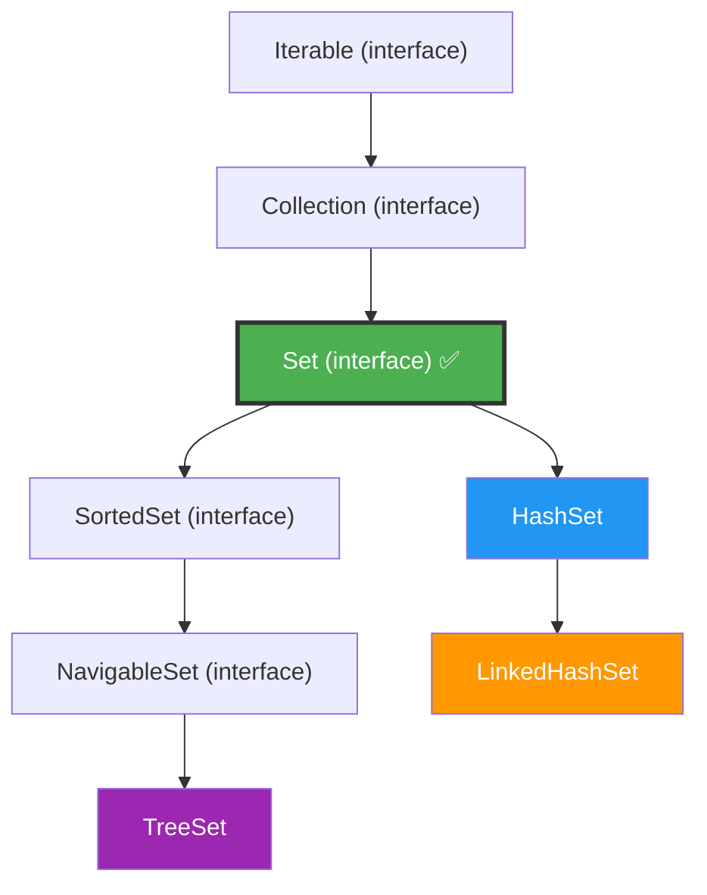

# Set Interface in Java — Complete Beginner-Friendly Notes

> Part of the [Java Collection Framework Notes](../README.md)
> **For:** Java learners preparing for interviews (beginner to intermediate).
> **Last Updated:** June 2026 | Java 21 LTS

---

## Table of Contents

1. [Introduction to Set](#1-introduction-to-set)
2. [Set Interface Hierarchy](#2-set-interface-hierarchy)
3. [Implementations of Set](#3-implementations-of-set)
4. [Creating a Set](#4-creating-a-set)
5. [Adding Elements](#5-adding-elements)
6. [Accessing Elements](#6-accessing-elements)
7. [Removing Elements](#7-removing-elements)
8. [Iterating Over a Set](#8-iterating-over-a-set)
9. [Set Operations (Union, Intersection, Difference)](#9-set-operations-union-intersection-difference)
10. [Commonly Used Methods](#10-commonly-used-methods)
11. [HashSet vs LinkedHashSet vs TreeSet](#11-hashset-vs-linkedhashset-vs-treeset)
12. [Performance — Time Complexity](#12-performance--time-complexity)
13. [Interview Questions and Answers](#13-interview-questions-and-answers)
14. [LinkedHashSet — In-Depth](#14-linkedhashset--in-depth)
15. [TreeSet — In-Depth](#15-treeset--in-depth)
16. [Summary](#16-summary)

---

## 1. Introduction to Set

### What is Set?

`Set` is an **interface** in the Java Collection Framework (`java.util` package) that represents a collection of **unique elements** — it does **not allow duplicates**.

```java
import java.util.HashSet;
import java.util.Set;

Set<String> fruits = new HashSet<>();
fruits.add("Apple");
fruits.add("Banana");
fruits.add("Apple");  // duplicate — ignored!

System.out.println(fruits);
System.out.println(fruits.size());
```

Output:

```
[Banana, Apple]
2
```

> Only 2 elements — the duplicate `"Apple"` was silently ignored.

### Simple Analogy

> **List** = A guest list where the same person's name can appear twice.
>
> **Set** = A guest list where each name can appear **only once**. If you try to write "Alice" again, the pen just refuses to write.

### Key Properties at a Glance

| Property | Set |
|---|---|
| Allows duplicates | **No** — every element must be unique |
| Allows null | Yes (one `null`) in `HashSet` and `LinkedHashSet`; **No** in `TreeSet` |
| Maintains insertion order | Depends on implementation |
| Indexed access (`get(i)`) | **No** — Set has no index-based access |
| Thread-safe | No (by default) |
| Common implementations | `HashSet`, `LinkedHashSet`, `TreeSet` |

---

## 2. Set Interface Hierarchy



> [!IMPORTANT]
> **Interview Point:** `Set` is an interface — you cannot instantiate it directly. You always use an implementation class like `HashSet`, `LinkedHashSet`, or `TreeSet`.

---

## 3. Implementations of Set

### Overview

| Implementation | Internal Structure | Ordering | Null? | Performance |
|---|---|---|---|---|
| `HashSet` | Hash Table | **No order** (unordered) | 1 null allowed | O(1) — fastest |
| `LinkedHashSet` | Hash Table + Linked List | **Insertion order** | 1 null allowed | O(1) — slightly slower than HashSet |
| `TreeSet` | Red-Black Tree (self-balancing BST) | **Sorted order** (natural / Comparator) | **No** null | O(log n) |

### Simple Analogies

> **HashSet** = A bag of unique marbles. You toss them in — no order is maintained, but every marble is different.
>
> **LinkedHashSet** = A numbered checklist. Each item is unique, and you remember the order you wrote them down.
>
> **TreeSet** = A dictionary. Every word is unique and they are always arranged in alphabetical (sorted) order.

---

## 4. Creating a Set

```java
import java.util.Set;
import java.util.HashSet;
import java.util.LinkedHashSet;
import java.util.TreeSet;
```

### Method 1 — HashSet (most common)

```java
Set<String> set = new HashSet<>();
set.add("C");
set.add("A");
set.add("B");
System.out.println(set);
```

Output:

```
[A, B, C]
```

> Order is **unpredictable** — it might print in any order.

### Method 2 — LinkedHashSet (preserves insertion order)

```java
Set<String> set = new LinkedHashSet<>();
set.add("C");
set.add("A");
set.add("B");
System.out.println(set);
```

Output:

```
[C, A, B]
```

> Elements appear in the **order they were added**.

### Method 3 — TreeSet (sorted order)

```java
Set<String> set = new TreeSet<>();
set.add("C");
set.add("A");
set.add("B");
System.out.println(set);
```

Output:

```
[A, B, C]
```

> Elements are **automatically sorted** (alphabetical for Strings, ascending for numbers).

### Method 4 — From Another Collection

```java
List<Integer> numbers = List.of(3, 1, 2, 3, 1);
Set<Integer> unique = new HashSet<>(numbers);
System.out.println(unique);
```

Output:

```
[1, 2, 3]
```

> Quick trick to **remove duplicates** from a List.

---

## 5. Adding Elements

### `add(element)` — Returns `true` if Added, `false` if Duplicate

```java
Set<String> set = new HashSet<>();

System.out.println(set.add("Alice"));   // true  — added
System.out.println(set.add("Bob"));     // true  — added
System.out.println(set.add("Alice"));   // false — duplicate, not added

System.out.println(set);
```

Output:

```
true
true
false
[Alice, Bob]
```

> [!TIP]
> Unlike `List.add()` which always returns `true`, `Set.add()` tells you whether the element was actually new. This is useful for checking if an item already exists.

### `addAll(collection)` — Add Multiple Elements

```java
Set<String> set = new HashSet<>(Set.of("Alice", "Bob"));
set.addAll(Set.of("Charlie", "Alice"));  // Alice is duplicate — ignored

System.out.println(set);
```

Output:

```
[Alice, Bob, Charlie]
```

---

## 6. Accessing Elements

**Set has no `get(index)` method.** You cannot access elements by index — this is the biggest difference from `List`.

### Check if Element Exists — `contains()`

```java
Set<String> set = new HashSet<>(Set.of("Alice", "Bob", "Charlie"));

System.out.println(set.contains("Bob"));    // true
System.out.println(set.contains("Dave"));   // false
```

Output:

```
true
false
```

> [!NOTE]
> `contains()` is **O(1)** in `HashSet` — much faster than `ArrayList`'s O(n) `contains()`. This is why Sets are ideal when you need fast "does this exist?" checks.

### Check Size and Emptiness

```java
System.out.println(set.size());      // 3
System.out.println(set.isEmpty());   // false
```

---

## 7. Removing Elements

### `remove(element)` — Returns `true` if Found and Removed

```java
Set<String> set = new HashSet<>(Set.of("Alice", "Bob", "Charlie"));

System.out.println(set.remove("Bob"));    // true
System.out.println(set.remove("Dave"));   // false — not found

System.out.println(set);
```

Output:

```
true
false
[Alice, Charlie]
```

### `removeAll(collection)` — Remove Multiple Elements

```java
Set<String> set = new HashSet<>(Set.of("A", "B", "C", "D"));
set.removeAll(Set.of("B", "D"));

System.out.println(set);
```

Output:

```
[A, C]
```

### `removeIf(condition)` — Conditional Removal *(Java 8+)*

```java
Set<Integer> numbers = new HashSet<>(Set.of(1, 2, 3, 4, 5, 6));
numbers.removeIf(n -> n % 2 == 0);  // remove all even numbers

System.out.println(numbers);
```

Output:

```
[1, 3, 5]
```

### `clear()` — Remove Everything

```java
set.clear();
System.out.println(set);        // []
System.out.println(set.size()); // 0
```

---

## 8. Iterating Over a Set

### Method 1 — Enhanced For-Each Loop *(most common)*

```java
Set<String> set = new LinkedHashSet<>(Set.of("Alice", "Bob", "Charlie"));

for (String name : set) {
    System.out.println(name);
}
```

### Method 2 — forEach with Lambda *(Java 8+)*

```java
set.forEach(name -> System.out.println(name));

// Even shorter:
set.forEach(System.out::println);
```

### Method 3 — Iterator

Best when you need to **safely remove** elements during iteration.

```java
Iterator<String> it = set.iterator();
while (it.hasNext()) {
    String name = it.next();
    if (name.equals("Bob")) {
        it.remove();  // safe removal
    }
}
```

### Method 4 — Stream API *(Java 8+)*

```java
set.stream()
   .filter(name -> name.startsWith("A"))
   .forEach(System.out::println);
```

---

## 9. Set Operations (Union, Intersection, Difference)

Sets in Java naturally support **mathematical set operations** using built-in methods.

### Union (combine all elements)

```java
Set<Integer> a = new HashSet<>(Set.of(1, 2, 3));
Set<Integer> b = new HashSet<>(Set.of(3, 4, 5));

Set<Integer> union = new HashSet<>(a);
union.addAll(b);

System.out.println(union);
```

Output:

```
[1, 2, 3, 4, 5]
```

### Intersection (common elements only)

```java
Set<Integer> intersection = new HashSet<>(a);
intersection.retainAll(b);

System.out.println(intersection);
```

Output:

```
[3]
```

### Difference (elements in A but not in B)

```java
Set<Integer> difference = new HashSet<>(a);
difference.removeAll(b);

System.out.println(difference);
```

Output:

```
[1, 2]
```

### Visual Representation

```
Set A: {1, 2, 3}        Set B: {3, 4, 5}

Union (A ∪ B):         {1, 2, 3, 4, 5}    → addAll()
Intersection (A ∩ B):  {3}                 → retainAll()
Difference (A - B):    {1, 2}              → removeAll()
```

---

## 10. Commonly Used Methods

| Method | What It Does | Returns | Time (HashSet) |
|---|---|---|---|
| `add(e)` | Adds element if not present | `true`/`false` | O(1) |
| `remove(e)` | Removes element if present | `true`/`false` | O(1) |
| `contains(e)` | Checks if element exists | `boolean` | O(1) |
| `size()` | Number of elements | `int` | O(1) |
| `isEmpty()` | Is the set empty? | `boolean` | O(1) |
| `clear()` | Removes all elements | `void` | O(n) |
| `addAll(c)` | Adds all from another collection (Union) | `boolean` | O(n) |
| `retainAll(c)` | Keeps only common elements (Intersection) | `boolean` | O(n) |
| `removeAll(c)` | Removes all matching elements (Difference) | `boolean` | O(n) |
| `removeIf(predicate)` | Removes elements matching condition | `boolean` | O(n) |
| `containsAll(c)` | Does set contain all elements of c? | `boolean` | O(n) |
| `toArray()` | Converts to array | `Object[]` | O(n) |

---

## 11. HashSet vs LinkedHashSet vs TreeSet

| Feature | HashSet | LinkedHashSet | TreeSet |
|---|---|---|---|
| Internal structure | Hash Table | Hash Table + Doubly Linked List | Red-Black Tree |
| Ordering | **No order** | **Insertion order** | **Sorted order** |
| `add()` / `remove()` / `contains()` | **O(1)** | **O(1)** | **O(log n)** |
| Null elements | 1 null allowed | 1 null allowed | **Not allowed** |
| Memory usage | Lowest | Medium (extra linked list) | Highest (tree nodes) |
| Implements `SortedSet`? | No | No | **Yes** |
| Best for | General-purpose, fastest | When insertion order matters | When sorted order is needed |

### When to Use Which?

```
Need unique elements?
    └── Yes
        ├── Order doesn't matter → HashSet ✅ (fastest)
        ├── Need insertion order → LinkedHashSet ✅
        └── Need sorted order   → TreeSet ✅
```

### TreeSet-Specific Methods

Because `TreeSet` implements `NavigableSet`, it has extra methods:

```java
TreeSet<Integer> ts = new TreeSet<>(Set.of(10, 20, 30, 40, 50));

System.out.println(ts.first());       // 10    — smallest
System.out.println(ts.last());        // 50    — largest
System.out.println(ts.lower(30));     // 20    — strictly less than 30
System.out.println(ts.higher(30));    // 40    — strictly greater than 30
System.out.println(ts.floor(25));     // 20    — greatest element ≤ 25
System.out.println(ts.ceiling(25));   // 30    — smallest element ≥ 25
System.out.println(ts.headSet(30));   // [10, 20]     — elements < 30
System.out.println(ts.tailSet(30));   // [30, 40, 50] — elements ≥ 30
```

---

## 12. Performance — Time Complexity

| Operation | HashSet | LinkedHashSet | TreeSet |
|---|---|---|---|
| `add(e)` | **O(1)** | **O(1)** | O(log n) |
| `remove(e)` | **O(1)** | **O(1)** | O(log n) |
| `contains(e)` | **O(1)** | **O(1)** | O(log n) |
| `size()` / `isEmpty()` | **O(1)** | **O(1)** | **O(1)** |
| Iteration | O(n + capacity) | **O(n)** | **O(n)** |
| Sorted operations (`first`, `last`) | N/A | N/A | **O(log n)** |

> **Interview Tip:** `HashSet` is fastest for add/remove/contains. `TreeSet` is slower but gives you sorted data + range queries. `LinkedHashSet` gives you predictable iteration order at minimal extra cost.

---

## 13. Interview Questions and Answers

**Q1. What is the Set interface in Java?**

> `Set` is an interface in `java.util` that represents a collection of **unique elements**. It does not allow duplicates and extends the `Collection` interface.

---

**Q2. What are the main implementations of Set?**

> - `HashSet` — unordered, O(1), backed by a hash table.
> - `LinkedHashSet` — insertion-ordered, O(1), backed by a hash table + linked list.
> - `TreeSet` — sorted, O(log n), backed by a Red-Black tree.

---

**Q3. How does HashSet check for duplicates?**

> It uses `hashCode()` to find the bucket, then `equals()` to check if an identical element already exists. If both match, the element is rejected. This is why you must override **both** `hashCode()` and `equals()` for custom objects.

---

**Q4. Can a Set contain null?**

> `HashSet` and `LinkedHashSet` allow **one** `null` element. `TreeSet` does **not** allow `null` because it needs to compare elements for sorting, and `null` cannot be compared.

---

**Q5. What is the difference between List and Set?**

> `List` allows duplicates and has index-based access (`get(i)`). `Set` enforces uniqueness and has no index-based access. Use `Set` when you need unique elements; use `List` when order and duplicates matter.

---

**Q6. What is the difference between HashSet and TreeSet?**

> `HashSet` uses a hash table — O(1) operations, no ordering. `TreeSet` uses a Red-Black tree — O(log n) operations, elements are sorted. `TreeSet` also provides navigation methods like `first()`, `last()`, `headSet()`, `tailSet()`.

---

**Q7. When should you use LinkedHashSet?**

> When you need both **unique elements** and **predictable iteration order** (insertion order). It is slightly slower than `HashSet` but maintains the order in which elements were added.

---

**Q8. How do you convert a List with duplicates to a unique Set?**

> ```java
> List<Integer> list = List.of(1, 2, 2, 3, 3);
> Set<Integer> unique = new LinkedHashSet<>(list); // preserves order
> ```

---

**Q9. How do you perform Union, Intersection, and Difference on Sets?**

> - **Union:** `a.addAll(b)` — combines both sets.
> - **Intersection:** `a.retainAll(b)` — keeps only common elements.
> - **Difference:** `a.removeAll(b)` — removes elements of b from a.

---

**Q10. Is Set thread-safe?**

> No. For thread safety, use `Collections.synchronizedSet(new HashSet<>())` or `ConcurrentSkipListSet` (sorted, thread-safe) or `CopyOnWriteArraySet` (read-heavy).

---

## 14. LinkedHashSet — In-Depth

### What is LinkedHashSet?

`LinkedHashSet` is a `HashSet` that also **remembers the order** in which elements were inserted. It combines the speed of `HashSet` with **predictable iteration order**.

```java
import java.util.LinkedHashSet;
import java.util.Set;

Set<String> set = new LinkedHashSet<>();
set.add("Charlie");
set.add("Alice");
set.add("Bob");
set.add("Alice");  // duplicate — ignored

System.out.println(set);
```

Output:

```
[Charlie, Alice, Bob]
```

> Elements come out in the **exact order** they were first added. `"Alice"` appears at position 2, not at the end, because the second `add("Alice")` was ignored.

### Simple Analogy

> **HashSet** = A jar of unique coins thrown in randomly — you grab them out in no particular order.
>
> **LinkedHashSet** = A display case of unique coins placed one by one — they stay in the order you placed them.

### Key Characteristics

| Property | LinkedHashSet |
|---|---|
| Internal structure | Hash Table + Doubly Linked List |
| Ordering | **Insertion order** |
| Allows duplicates | No |
| Allows null | Yes (one `null`) |
| Thread-safe | No |
| Performance | O(1) for add, remove, contains |
| Extends | `HashSet` |

### How It Works Internally

LinkedHashSet is backed by a **hash table** (for fast lookups) plus a **doubly linked list** running through all entries (to maintain insertion order).

```
Hash Table (for O(1) lookup):
┌────────┬────────┬────────┬────────┐
│ Bucket │ Bucket │ Bucket │ Bucket │
│   0    │   1    │   2    │   3    │
│ "Bob"  │        │"Alice" │"Charlie"
└────────┴────────┴────────┴────────┘

Linked List (for insertion order):
  "Charlie" ↔ "Alice" ↔ "Bob"
  (first)                (last)
```

> [!NOTE]
> This extra linked list is why `LinkedHashSet` uses slightly more memory than `HashSet`, but it guarantees that iteration follows insertion order.

### Constructors

```java
// 1. Empty LinkedHashSet
Set<String> set1 = new LinkedHashSet<>();

// 2. With initial capacity
Set<String> set2 = new LinkedHashSet<>(50);

// 3. With initial capacity and load factor
Set<String> set3 = new LinkedHashSet<>(50, 0.75f);

// 4. From another collection (preserves that collection's order)
List<String> names = List.of("Alice", "Bob", "Charlie");
Set<String> set4 = new LinkedHashSet<>(names);
System.out.println(set4); // [Alice, Bob, Charlie]
```

### Commonly Used Methods

LinkedHashSet inherits all methods from `HashSet`. There are **no new methods** — the only difference is ordering behavior.

| Method | What It Does | Time |
|---|---|---|
| `add(e)` | Adds element, maintains insertion order | O(1) |
| `remove(e)` | Removes element | O(1) |
| `contains(e)` | Checks if element exists | O(1) |
| `size()` | Number of elements | O(1) |
| `isEmpty()` | Is the set empty? | O(1) |
| `clear()` | Removes all elements | O(n) |
| `iterator()` | Returns iterator in **insertion order** | O(1) |

### Practical Example — Removing Duplicates While Preserving Order

This is the **most common use case** for `LinkedHashSet`.

```java
List<String> cities = List.of("Mumbai", "Delhi", "Mumbai", "Bangalore", "Delhi", "Chennai");

// Remove duplicates but keep the order they first appeared
Set<String> unique = new LinkedHashSet<>(cities);

System.out.println(unique);
```

Output:

```
[Mumbai, Delhi, Bangalore, Chennai]
```

> With `HashSet`, the order would be unpredictable. With `LinkedHashSet`, the first occurrence order is preserved.

### Practical Example — Maintaining a Recent History

```java
LinkedHashSet<String> recentSearches = new LinkedHashSet<>();
recentSearches.add("Java Collections");
recentSearches.add("LinkedHashSet");
recentSearches.add("TreeSet");
recentSearches.add("Java Collections"); // duplicate — not added again

System.out.println("Recent searches: " + recentSearches);
```

Output:

```
Recent searches: [Java Collections, LinkedHashSet, TreeSet]
```

> [!TIP]
> **When to use LinkedHashSet:**
> - You need unique elements **and** insertion order.
> - You are removing duplicates from a list but want to keep original order.
> - You need a cache-like structure where order matters.

---

## 15. TreeSet — In-Depth

### What is TreeSet?

`TreeSet` is a `Set` implementation that keeps elements in **sorted order** (ascending by default). It is backed by a **Red-Black Tree** — a self-balancing binary search tree.

```java
import java.util.TreeSet;
import java.util.Set;

Set<Integer> numbers = new TreeSet<>();
numbers.add(40);
numbers.add(10);
numbers.add(30);
numbers.add(20);

System.out.println(numbers);
```

Output:

```
[10, 20, 30, 40]
```

> No matter what order you add elements, they are always stored **sorted**.

### Simple Analogy

> **HashSet** = A pile of books on a desk — no particular order, but you can quickly check if a book is there.
>
> **TreeSet** = A bookshelf sorted by title — you can find any book and also easily find "all books from A to M".

### Key Characteristics

| Property | TreeSet |
|---|---|
| Internal structure | Red-Black Tree (self-balancing BST) |
| Ordering | **Sorted** (natural order or custom Comparator) |
| Allows duplicates | No |
| Allows null | **No** — throws `NullPointerException` |
| Thread-safe | No |
| Performance | O(log n) for add, remove, contains |
| Implements | `NavigableSet`, `SortedSet`, `Set` |

### How It Works Internally

TreeSet uses a **Red-Black Tree** — a balanced binary tree where every node is colored either red or black to maintain balance.

```
Adding: 40, 10, 30, 20

Resulting Red-Black Tree:

           30 (Black)
          /  \
    10 (Red)  40 (Black)
      \
     20 (Black)

In-order traversal gives: 10, 20, 30, 40 (sorted!)
```

> [!NOTE]
> You don't need to understand Red-Black Tree balancing rules for interviews. Just know that it keeps the tree balanced so all operations stay at O(log n).

### Constructors

```java
// 1. Empty TreeSet — natural ordering (ascending)
TreeSet<Integer> set1 = new TreeSet<>();

// 2. With custom Comparator — descending order
TreeSet<Integer> set2 = new TreeSet<>(Comparator.reverseOrder());
set2.add(10);
set2.add(30);
set2.add(20);
System.out.println(set2); // [30, 20, 10]

// 3. From another collection
List<Integer> nums = List.of(5, 3, 1, 4, 2);
TreeSet<Integer> set3 = new TreeSet<>(nums);
System.out.println(set3); // [1, 2, 3, 4, 5]

// 4. From another SortedSet
TreeSet<Integer> set4 = new TreeSet<>(set3);
```

### Commonly Used Methods

TreeSet has all standard `Set` methods **plus** navigation methods from `NavigableSet`.

#### 🟢 Standard Set Methods

| Method | What It Does | Time |
|---|---|---|
| `add(e)` | Adds element in sorted position | O(log n) |
| `remove(e)` | Removes element | O(log n) |
| `contains(e)` | Checks if element exists | O(log n) |
| `size()` | Number of elements | O(1) |
| `isEmpty()` | Is the set empty? | O(1) |
| `clear()` | Removes all elements | O(n) |

#### 🔵 Navigation Methods (TreeSet-specific)

| Method | What It Does | Example (set = {10,20,30,40,50}) |
|---|---|---|
| `first()` | Returns the **smallest** element | `10` |
| `last()` | Returns the **largest** element | `50` |
| `lower(e)` | Greatest element **strictly less** than e | `lower(30)` → `20` |
| `higher(e)` | Smallest element **strictly greater** than e | `higher(30)` → `40` |
| `floor(e)` | Greatest element **≤** e | `floor(25)` → `20` |
| `ceiling(e)` | Smallest element **≥** e | `ceiling(25)` → `30` |
| `pollFirst()` | Removes and returns the **smallest** | removes `10` |
| `pollLast()` | Removes and returns the **largest** | removes `50` |

```java
TreeSet<Integer> ts = new TreeSet<>(Set.of(10, 20, 30, 40, 50));

System.out.println("First: " + ts.first());       // 10
System.out.println("Last: " + ts.last());          // 50
System.out.println("Lower(30): " + ts.lower(30));  // 20
System.out.println("Higher(30): " + ts.higher(30));// 40
System.out.println("Floor(25): " + ts.floor(25));  // 20
System.out.println("Ceiling(25): " + ts.ceiling(25));// 30
```

Output:

```
First: 10
Last: 50
Lower(30): 20
Higher(30): 40
Floor(25): 20
Ceiling(25): 30
```

#### 🟣 Range View Methods

| Method | What It Does | Example (set = {10,20,30,40,50}) |
|---|---|---|
| `headSet(e)` | Elements **< e** | `headSet(30)` → `[10, 20]` |
| `headSet(e, true)` | Elements **≤ e** | `headSet(30, true)` → `[10, 20, 30]` |
| `tailSet(e)` | Elements **≥ e** | `tailSet(30)` → `[30, 40, 50]` |
| `tailSet(e, false)` | Elements **> e** | `tailSet(30, false)` → `[40, 50]` |
| `subSet(from, to)` | Elements **≥ from** and **< to** | `subSet(20, 40)` → `[20, 30]` |

```java
TreeSet<Integer> ts = new TreeSet<>(Set.of(10, 20, 30, 40, 50));

System.out.println(ts.headSet(30));        // [10, 20]
System.out.println(ts.headSet(30, true));  // [10, 20, 30]
System.out.println(ts.tailSet(30));        // [30, 40, 50]
System.out.println(ts.subSet(20, 40));     // [20, 30]
```

Output:

```
[10, 20]
[10, 20, 30]
[30, 40, 50]
[20, 30]
```

### Custom Sorting with Comparator

```java
// Sort strings by length — shortest first
TreeSet<String> set = new TreeSet<>(Comparator.comparingInt(String::length));
set.add("Banana");
set.add("Fig");
set.add("Kiwi");
set.add("Watermelon");

System.out.println(set);
```

Output:

```
[Fig, Kiwi, Banana, Watermelon]
```

> [!IMPORTANT]
> **Interview Point:** If you add custom objects to a `TreeSet` without providing a `Comparator` and the class doesn't implement `Comparable`, you get `ClassCastException` at runtime.

### Practical Example — Finding Students in a Score Range

```java
TreeSet<Integer> scores = new TreeSet<>(Set.of(45, 67, 72, 85, 91, 55, 38));

// Students who scored between 50 and 80
System.out.println("Scores 50-80: " + scores.subSet(50, true, 80, true));

// Top scorer
System.out.println("Highest: " + scores.last());

// Lowest scorer
System.out.println("Lowest: " + scores.first());
```

Output:

```
Scores 50-80: [55, 67, 72]
Highest: 91
Lowest: 38
```

> [!TIP]
> **When to use TreeSet:**
> - You need elements to be always **sorted**.
> - You need **range queries** (headSet, tailSet, subSet).
> - You need `first()`, `last()`, `floor()`, `ceiling()` operations.
> - You don't need `null` values.

---

## 16. Summary

```
Set Interface in a Nutshell:
━━━━━━━━━━━━━━━━━━━━━━━━━━━━━━━━━━━━━━━━━━━━━━━━━━━━━━━━
  1. Set stores unique elements — no duplicates allowed.
  2. It has no index-based access (no get(i)).
  3. HashSet is the fastest (O(1)) — use as default.
  4. LinkedHashSet maintains insertion order.
  5. TreeSet keeps elements sorted (O(log n)).
  6. Use addAll/retainAll/removeAll for set operations.
  7. Always override hashCode() and equals() for custom objects.
━━━━━━━━━━━━━━━━━━━━━━━━━━━━━━━━━━━━━━━━━━━━━━━━━━━━━━━━
```

**When to use Set:**
- You need to store unique elements only.
- You need fast `contains()` checks — O(1) with `HashSet`.
- You need to remove duplicates from a collection.
- You need to perform union, intersection, or difference operations.

**When NOT to use Set:**
- You need duplicate elements → use `List`.
- You need index-based access (`get(i)`) → use `ArrayList`.
- You need key-value pairs → use `Map`.
- You need a FIFO queue → use `Queue`.

---

*Part of [Java Collection Framework Notes](../README.md).*
